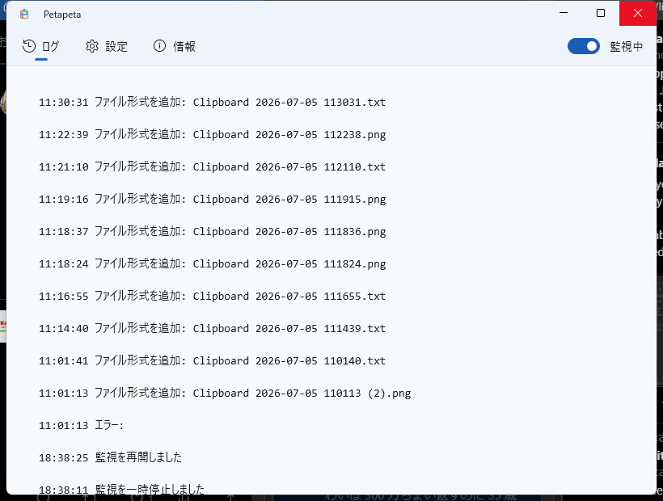

むかし [BeOS](https://ja.wikipedia.org/wiki/BeOS) を使っていたとき、クリップボードにコピーした画像やテキストをデスクトップに貼り付けると、自動的にファイルができるという機能がありました。ちょっとしたスクラップを集めておくのにとても便利だったので、あの挙動を Windows で再現しようと Claude の助けを借りて開発しました。

タスクトレイに常駐してクリップボードを監視し、コピーした内容をデスクトップやフォルダーへそのままファイルとして貼り付けられるようにする Windows デスクトップ アプリです。

## 特徴

- クリップボードの画像を PNG、テキストを .txt にファイル化（どちらも個別にオン/オフ可能）
- 貼り付けの準備ができたら通知音でお知らせ（音のカスタマイズ・テスト再生に対応）
- 保持日数・最大件数にもとづく自動クリーンアップ
- ライト / ダーク / システム連動のテーマ切り替え
- 日本語 / English の多言語対応
- Windows 起動時の自動開始・最小化起動に対応

## 動作要件

- Windows 10 バージョン 1809 以降（Windows 11 推奨）

## 使い方

1. Petapeta を起動する（タスクトレイに常駐します）
2. いつもどおり画像やテキストをコピーする
3. デスクトップやフォルダーで Ctrl+V すると、ファイルとして貼り付けられる

画像は PNG ファイル、テキストは .txt ファイルになります。

## 設定

タスクトレイのアイコンからウィンドウを開き、「設定」タブで各種の挙動を変更できます。

- **対象** — 画像のファイル化・テキストのファイル化をそれぞれオン/オフ
- **クリーンアップ** — ステージングファイルの保持日数・最大保持件数
- **通知音** — 貼り付け準備完了時の通知音のカスタマイズ・テスト再生

## ダウンロード

[Releases · daruyanagi/Petapeta](https://github.com/daruyanagi/Petapeta/releases)

現時点では GitHub Releases から ZIP をダウンロードしてお使いください。x64 版と arm64 版を用意しています。手元では Windows 11 Pro（Retail）で動作を確認しています。

## ライセンス

MIT
