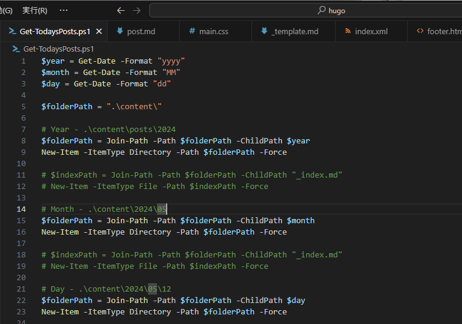
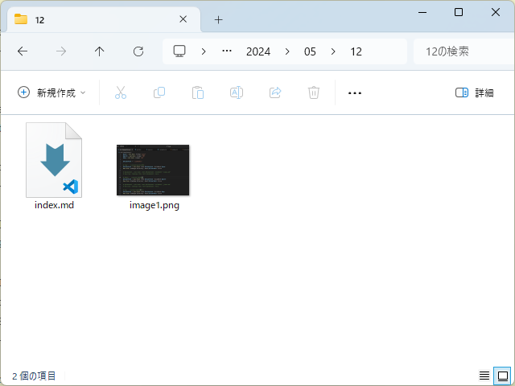

Hugo では `hugo new post/hello.md` することで `archetypes/default.md` などをテンプレートに新規ポストを生成してくれる。

しかし、自分は新しいファイル名を考えるのがだるい。それに、`post` フォルダーに記事ファイルが溜まっていくのも嫌だし、記事と画像を別のフォルダーで管理するのも億劫だ。なので、今日の日記、つまりデイリーポストを書くときは `./content/2024/05/12/index.md` を自動生成し、関連画像も `./content/2024/05/12/` フォルダーに放り込んでおくスタイルを好む。1 日 1 フォルダーというわけだ。



このスタイルの欠点は、1日に複数の記事を書くことを考慮していない点だが、自分はそこまで筆まめではないので困らないだろう。

そんな訳で、年月日でフォルダー階層（./content/2024/05/12/）を自動で掘って、名前(index.md)まで自動でつけるスクリプト `Get-TodaysPost.ps1` を PowerShell で書いてみた。

```pwsh

$year = Get-Date -Format "yyyy"
$month = Get-Date -Format "MM"
$day = Get-Date -Format "dd"

$folderPath = ".\content\"

# Year - .\content\posts\2024
$folderPath = Join-Path -Path $folderPath -ChildPath $year
New-Item -ItemType Directory -Path $folderPath -Force

# $indexPath = Join-Path -Path $folderPath -ChildPath "_index.md"
# New-Item -ItemType File -Path $indexPath -Force

# Month - .\content\2024\05
$folderPath = Join-Path -Path $folderPath -ChildPath $month
New-Item -ItemType Directory -Path $folderPath -Force

# $indexPath = Join-Path -Path $folderPath -ChildPath "_index.md"
# New-Item -ItemType File -Path $indexPath -Force

# Day - .\content\2024\05\12
$folderPath = Join-Path -Path $folderPath -ChildPath $day
New-Item -ItemType Directory -Path $folderPath -Force

# $indexPath = Join-Path -Path $folderPath -ChildPath "_index.md"
# New-Item -ItemType File -Path $indexPath -Force

$templatePath = ".\_template.md"
$postPath = Join-Path -Path $folderPath -ChildPath "index.md"

$dateTime = Get-Date -Format "o"
Get-Content $templatePath `
| ForEach-Object {$_ -replace "%%DATETIME%%", $dateTime} `
| Out-File $postPath -NoClobber

# Open Explorer
Invoke-Item -Path $folderPath

```

Hugo のルートフォルダーに `.\_template.md` を置き、`pwsh Get-TodaysPost.ps1` を実行すればフォルダーと `index.md` が作成される。そのとき、テンプレートファイル内の %%DATETIME%% が現在日時に置換される。自分に Golang の心得があれば `archetypes/default.md` を参照するなど、もう少しスマートな設計にできただろうが、それは今後の課題としておく。

ちなみに Hugo ではフォルダーをセクションとして扱い、各セクション（フォルダー）を認識させるには、そのルートに `_index.md` を置かなければならないと聞いた――が、これは古い情報なのだろうか。なくても暗黙に生成されるようなので、コメントアウトしておいた。

あと、最後にエクスプローラーでファイルを開くコードを一行入れておくと、Visual Studio Code で `index.md` を開いたり、画像を突っ込んだりするのに便利だ（Visual Studio Code のフォルダービューを使ってもいいのだが、マウス操作が若干シビアに感じる）。

