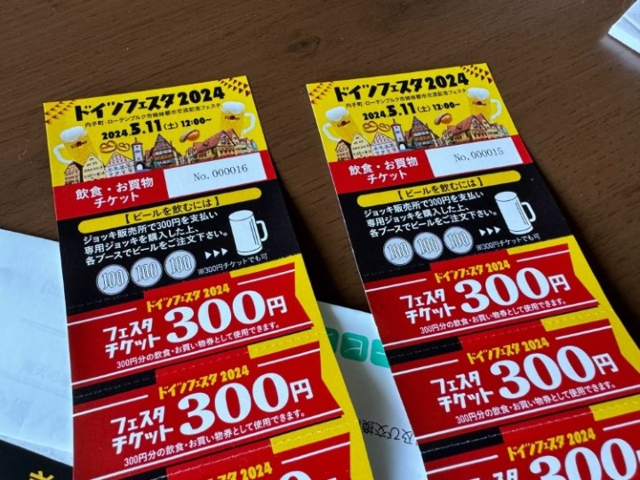
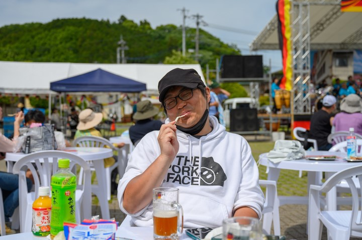
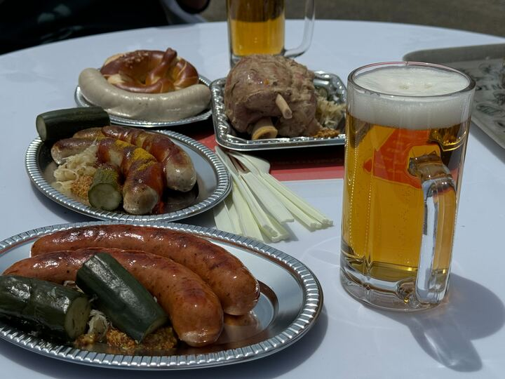

今年も――と言っても毎年いけているわけではないが――内子のドイツフェスタ 2024 に行ってきました。フジグラン松山で前売り券を買ったので、ちょっとだけお得でした。ただ、どうせ会場でビールジョッキ（300 円）を別途購入するために並ぶ必要があるので、無理して買う必要はなかったかもしれない。来年も今年のジョッキが使えるなら、前売り券を買っておくと入場がスムーズだと思います。

当日は晴れ。少し寒い日もあったので長袖にしてきたのですが、とても暑かったです。でも、脱いだら逮捕されそうなので、ビールを多めに飲んで汗をかくことで対策をしました。

ウィンナー（じゃないな、ブルスト？）とか肉の塊（名前忘れた）を買うと、3,000 円のチケットはすぐになくなってしまいました。二綴りぐらい追加で購入して、じゃんじゃか食べて、飲んで……白いビールから徐々に黒ビールへ移行し、また戻ってくるの繰り返し。暑いなか演奏もしていただいて、大いに盛り上がったと思います。

とくにザワークラウトとキュウリの漬物みたいなのはおいしかったです。来年はこれだけ盛り合わせにして売ってくれないかな？