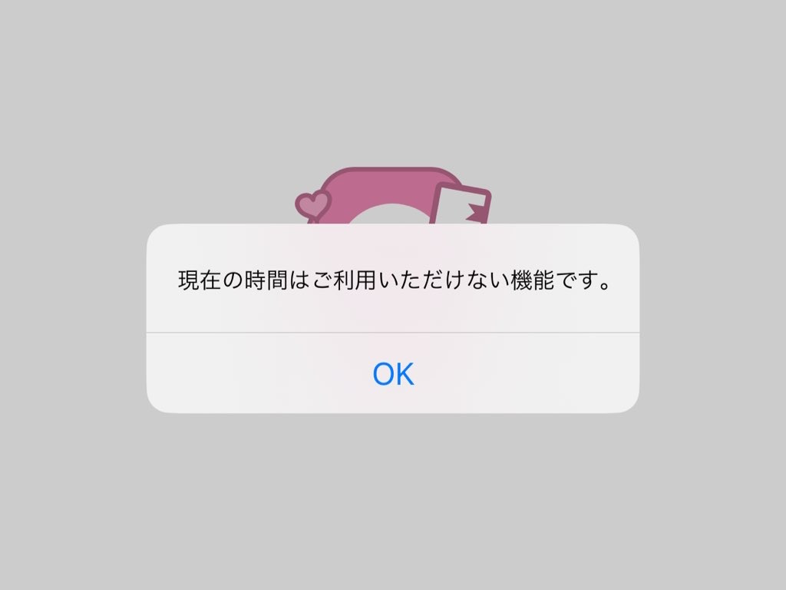
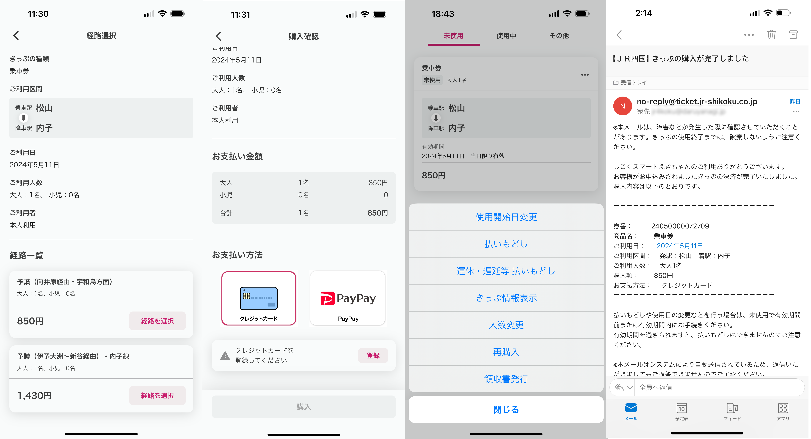
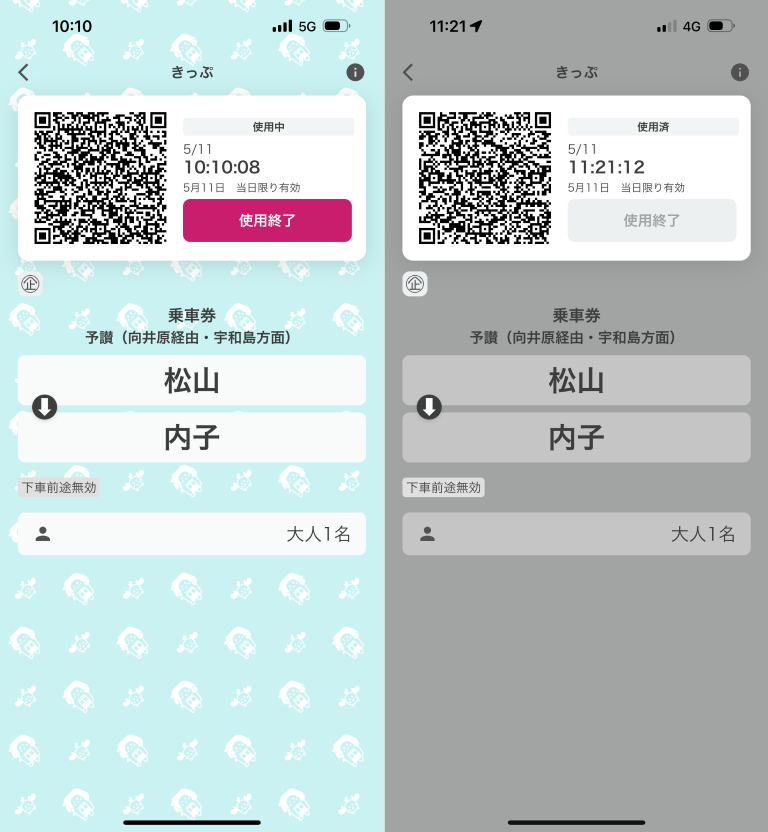

[内子のドイツフェスタ 2024 へ行く](../13/)ため、久しぶりに JR 四国を利用した。かねてから試してみたかった「スマえき」もついでに使ってみる。

JR 四国のキャッシュレス化は遅れており、ICOCA（SUICA 互換）が香川の方で使えるのみだ。しかし、モバイルアプリ「スマえき」（iOS/Android）を利用すれば、QR コードによるキャッシュレス乗車が可能になる。

> ＪＲ四国チケットアプリ  
> 「しこくスマートえきちゃん」とは・・・  
> お手持ちのスマートフォンで  
> 『いつでも・どこでも』  
> 『キャッシュレス』できっぷが買える  
> 『きっぷ画面提示』で列車に乗れる  
> JR四国のチケットアプリです。  
> 略して  
> 「スマえき」！  
> 
> [しこくスマートえきちゃん | スマえきとは](https://www.jr-eki.com/smart-eki/index.html)

決済に使えるのは、クレジットカードと PayPay。自分はクレジットカードを使ったが、クレジットカードの登録がパスワード管理アプリに対応しておらず、オートフィルが効かないのと、3D セキュア認証が必要なのはだるかった。決済すると認証コードの入力を求められ、メールで送られてくるのを待ち、コピー＆ペーストしなければならない。3D セキュアは名前の通り安全だが、これが毎回必要なのであれば煩雑すぎる。もっとも、帰りの切符を買うときは求められなかったので、あまり気にしなくていいのかもしれない。一度認証すれば、一定期間または同様の購入ならば認証プロセスなしで決済できるのだろう。

まぁ、PayPay が使える人はそっちの方が簡単なはずだ。

使い勝手は……意外と言っては失礼だが、悪くはなかった。よくあるイベントのチケットアプリのようで、この手のアプリを作るのに慣れたデベロッパーが手掛けているのだろう。とくに躓くところなく、スムーズに使えた。切符を買って、電車に乗ったら［使用開始］ボタンを押すだけ。降りると［使用終了］するか尋ねられたが、どういう仕組みになっているのだろう。GPS でも使っているのだろうか。

ただ、一つ謎なのは QR コードが現状、意味をなしていないことだ。切符の確認は、駅員や車掌の目視で行う。まさか JR 四国の職員に QR コードを読む能力が備わっているとは思えないので、今のところ QR コードはお飾りだ。いずれ職員が QR コードリーダーを携帯するか、今秋リニューアルオープン予定の JR 松山駅に QR コードリーダー付きの先進的な自動改札機が導入されるのだろう。そう思いたい。

ともあれ、JR 四国でもキャッシュレスが進んでいるのはちょっとうれしかった。問題点もいくつかあるけど、いずれ解消されると思いたい。

## メリット

- キャッシュレスで購入できる
- どこでも買える。事前に買える。現に、自分は行きしなの切符を 3 日前、自宅のリビングでゴロゴロしながら買った
- 切符をなくさない。実際、ビール祭りの連れが切符をなくして大変だった（見つかったらしいが）
- 定期券も買えるらしいので、窓口に並ばなくていい
- お得な切符を探せる（後述のデメリットで残念なことになっているが……）

## デメリット

- お気に入りの駅が 2 つまでしか登録できないらしい
- 買える切符は JR 四国管内のみ。需要の高そうな関西往復割り引き切符などは買えない
- 特急に乗るとき、特急券と乗車券を別々に買わないといけない（二度手間）。区間が一緒とは限らないので実装は難しいかもしれないが
- 指定席は買えないっぽい
- スマホの電源が切れたら困りそう。充電スポットが増えるとありがたい
- 夜中は買えない（ときがあるようだ）

## 今後に期待

- 特急券を買うときに同じ区間の乗車券も併せて買うためのショートカットボタンがあるといい
- iOS のウォレットなどにも対応していると利便性が向上しそう
- 関西往復切符ぐらいは買えるようになってほしい。グリーン席、指定席も買いたい

