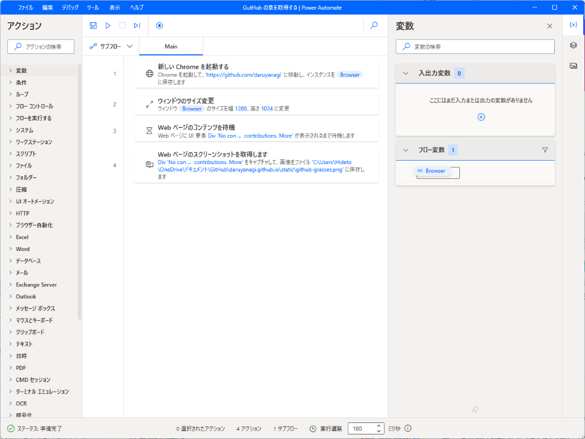

GitHub のコントリビューショングラフ（いわゆる芝生だの草だの呼ばれているやつ）を自分のブログに掲載したいというニーズに応えるため、かつて grass-graph というプロジェクトがあった。これを使えば、芝生を画像としてとってくれる。



しかし、今はプロジェクトがアーカイブされてしまっているようで、使うことはできない。かといって、自前でその手のサーバーを立てるのは億劫だ。

そこで、PowerAutomate for Desktop（PAD）を使ってとってくることにした。これは Microsoft が基本無償で提供している RPA ツール（デスクトップ操作の自動化）で、Windows 10 以降なら追加コストなしに利用できる。たとえば、GitHub の草を刈るフローは以下のように記述できる。

1. 新しい Chrome を起動する(Browser インスタンス) 
2. Browser インスタンスのウィンドウサイズを幅 1,20px、高さ 1,024px に変更する。十分なサイズがないと、芝生が隠れてしまうため 
3. Web ページのコンテンツを待機。念のため  
4. Web ページのスクリーンショットを取得して、適当な場所へ保存する 

コンテンツの選択はビジュアルに行えるから難しくはない。慣れたらビジュアルに選んだあと、テキストエディターで調整してやるといいのかもしれない。 

成功すると、以下のような草を取得できる。無駄なコンテンツが覆いかぶさらないように、［Windows］＋［D］や［Windows］＋［M］でデスクトップを一時的にきれいにしてやるとよい。フォトブース代わりにまっさらな仮想デスクトップを用意して、毎回そこで実行してもよいだろう。

PAD のフローにはグローバルショートカットキーを割り当てられるので、キーとポンと押すだけで GitHub から草を刈り取って、ブログリポジトリに埋めることができる。ブログをプッシュする前に実行してやるとよいだろう。無償ライセンスではサポートされていない定時実行フローを無限ループで無理矢理実現するハックはあるようだが、そこまでの必要はあるまい。