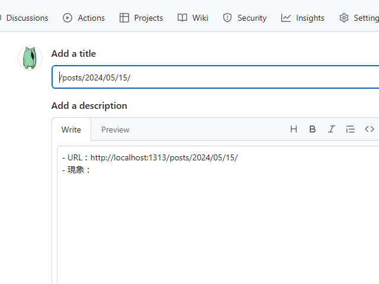

ブログ記事のフッターに「この記事の改善に協力する」というリンクを追加しました。クリックするとこんな感じで、GitHub の Issue 作成画面が開きます。モバイルだと、「GitHub」アプリがインストールしてあれば、そっちが起動するようですね。



このリンクは誰に使っていただいてもいいのですが、どちらかというと自分向けです。気が付いたときにちょろっとメモしておけば、修正を忘れることはありません。

コードも簡単です。

```html
<!-- /layouts/posts/single.html#footer -->
<div class="github-issue">
    <i class="fa-brands fa-github" aria-hidden="true"></i>
    <span>
        <a  href="https://github.com/daruyanagi/daruyanagi.github.io/issues/new?labels=bug&title={{ .RelPermalink }}&body=-%20URL%EF%BC%9A{{ .Permalink | safeURL }}%0A-%20%E7%8F%BE%E8%B1%A1%EF%BC%9A" 
            target="_blank" 
            rel="noopener">
        この記事の改善に協力する
        </a>
        （要 GitHub アカウント）
    </span>
</div>
```

ちょっと調整すればラベルやタイトル、本文を自分好みに設定できます。

これの応用で、ブックマークレットも用意しておくといろいろ捗ります。たとえば、他のサイトを読んでいて、これをブログの参考にしようと思ったときにポチッとな。ブログ記事みたいに上記リンクを掲出していないページで不具合を見つけたときなんかも役立ちます。まぁ、デスクトップ前提ですけど。

```javascript
javascript:(function(){ let u = document.location.href; let u = `https://github.com/daruyanagi/daruyanagi.github.io/issues/new?body=${u}`; window.open(u);  })();
```

