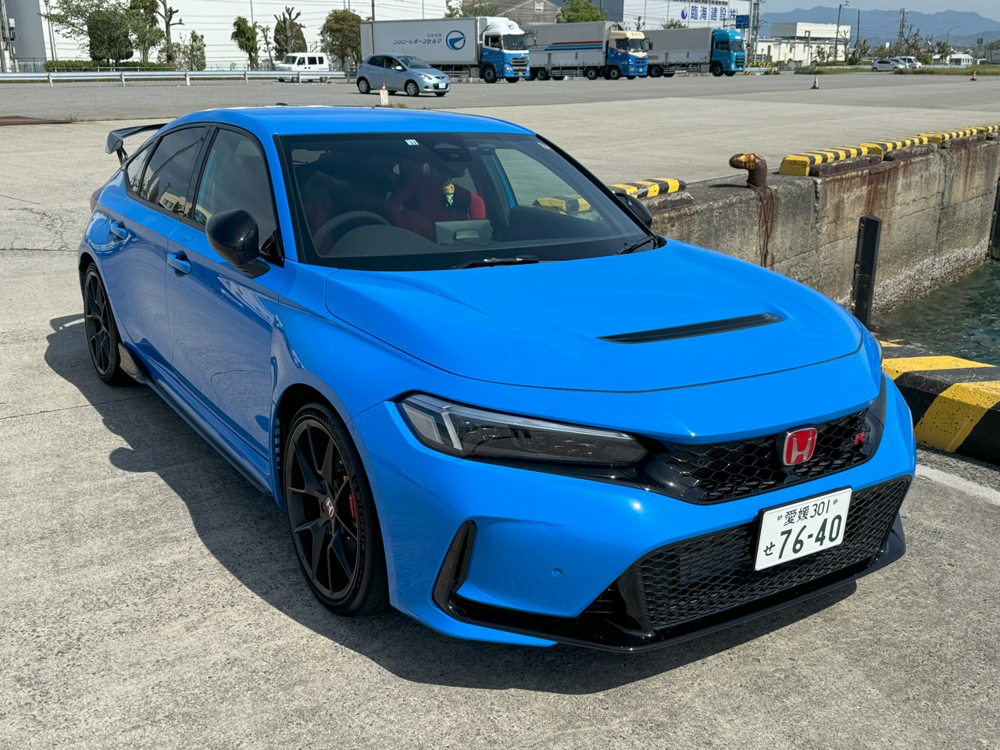

5 月 17 日はマンションの定例点検で停電となるので、CIVIC type R の 6 カ月点検を予約しておいた。点検は問題なく終わり、運転免許センターから高浜、三津までの海沿いの道をドライブし、港でコーヒーを飲んでゆっくりした。

クルマの走行距離はこの前 10,000km を超えたが、当然のことながらなんの問題もない。相変わらずの暴力的な加速、扱いやすいハンドリング、スコスコ入るシフトが気持ちのよいクルマだ。車幅はともかく、狭い市街地、田舎道だとちょっと前後への長さが気になるが、それ以外不満に感じるところはないだろう。

ちなみに、カスタムはほとんどしていない。ほぼノーマルで乗っている

- BlackVue ドライブレコーダー（Docomo SIM を入れて、自動でクラウドと連携する）
- ユーロホーン（クラクションの音がちょっとだけカッコよくなるが、鳴らしたことはない）
- ルームミラーにダークみきゃんの人形（常に揺れている）
- 後部座席にウサギのぬいぐるみ（ちゃんとシートベルトをさせている）
- 純正 Qi 非接触充電（ときどき充電されていないことがあるので要らなかった）
- 

コーヒーを飲んでいると、Synology のルーターからインターネット接続が復旧したという通知が入った。停電も終わったらしい。仕事も残っているので、いやいやながら帰らなければならない。

ところが、マンションにつくと、機械式駐車場にトラブルがあったようで、クルマを出せない人が途方に暮れていた。どうやら、定例点検後に問題がなく、業者が帰った後に、機械式駐車場が止まってしまったらしい。関係業者に連絡を付けて呼び出し、復旧するには時間がかかりそうなので、ちょっと邪魔だが、メモを残して適当なところに車を止めて部屋へ戻るコトン敷いた。

すると、エレベーターの前にも人だかりがしている。どうやらこっちもトラブっていたようだ。しょうがないので、運動がてら 14 階まで階段を登った。



日ごろの運動不足がたたって、大変苦労した。