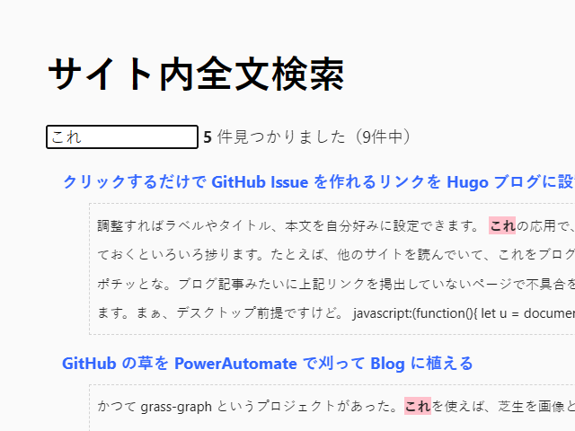

ブログに全文検索機能を付けました。 [/search](/search) から利用できます。

ソースコードは、ほぼ「まくまく Hugo ノート」からいただきました。ありがとうございます。



加えた変更は、以下の通り。



- ナビゲーションリンクへの追加
- content/search.md
- layouts/_default/search.html （利用しているテーマに馴染ませるために細部を変更）

独自の改良としては、テキストフラグメント（#:~:text=）に対応させました。これで検索結果のリンクをクリックすると、リンク先にジャンプして、検索ワードがハイライト＆出現箇所までスクロールされます。iOS では動かなかったのですが（未対応？）、デスクトップであれば Edge/Chrome などで動作するようです。



これはなかなか便利なのではないでしょうか！

## 今後の課題

- モダンな Javascript でリファクタリングしたい。フォーマット書式とか使えるはず
- [前のブログ](https://blog.daruyanagi.jp/) で思ったんだけど、記事本数が多くなると `/search` のファイルサイズが大きくなる。いずれは対策が必要になるかもしれない