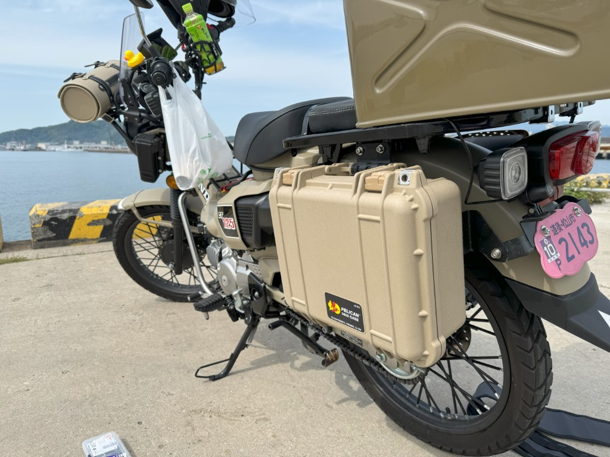

日曜日は天気がぐずぐずしていたので仕事をし、月曜日に休むことにした。起きたら、もう正午過ぎ。ハンターカブで三津港に行き、やろうとしていたカスタムに取り組んだ。天気は快晴で、平日のせいか釣り人もいない。椅子を組み立て、軽い昼食を摂り、工具袋を広げた。

今日のカスタムは、ペリカンボックスの取り付け。せいらん工房さんの[ハンターカブCT125 マルチTOOLBOXステ](https://seirankobo.com/items/64ac2d35ab0a1200312bc4ef)と一緒に取り付けた。



こういうボックスを取り付けられそうなステーは多数売っているが、

- 純正のツールボックスをつぶしてでも、ステーをできるだけ内側に押し入れたい（純正ツールボックスをそのまま付けられるタイプは、それを逃がす必要から、大きく左側面にはみ出る。将来的に厚みのあるボックスを取り付けることを考えると……）
- 十分な強度もっていそう（細いパイプなんかで作られていない）

という条件を満たすのは、せいらん工房さんのぐらいかなぁ？　といった感じ。お値段も法外というわけではない（ワンオフなら安いぐらいかもしれない）。

あまり金持ちではないので、2 万円ちょっとするボックスにマキタの電動ドリルで穴をあけるのは勇気がいったけれど、できあがりは――まぁ、ちょっと斜めになっている感じもあるが、個人的には満足だ。穴をあけたせいでせっかくの防水性は失われてしまったが、穴をあけた部分にはゴムなどをあてがって、できるだけ水が入ってこないようにしたい。

## 追伸

このペリカンボックスは頑丈で、防水性があり（失われたけど）、鍵をかけることもできるのだ ( ˘ω˘ )



