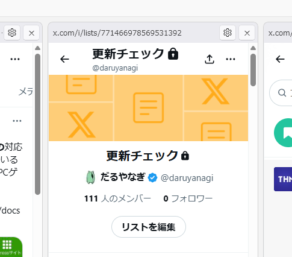
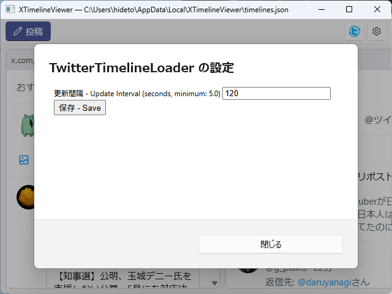

新しく開発したアプリケーション「XTimelineViewer」が、窓の杜（まどのもり）で紹介されました。

[「X Pro」難民に捧ぐ！複数タイムライン同時表示X（Twitter）アプリ「XTimelineViewer」【レビュー】 - 窓の杜](https://forest.watch.impress.co.jp/docs/review/2103113.html)

「XTimelineViewer」は、「X」の「プレミアムプラス」プランに契約できない貧乏人のための「X Pro」です。ダウンロードは「GitHub」からどうぞ。基本的な使い方もそっちに書いてあります。

[daruyanagi/XTimelineViewer](https://github.com/daruyanagi/XTimelineViewer)

## FAQ

以下は、読者の反応をもとにまとめた FAQ です。

### 複数アカウントのTLを同時に表示できてポストできないか



v1.1 で試験機能として TwitterTimelineLoader と競合しないように投稿画面の **プロファイルを分離** する機能を実装しています。それを応用すれば、マルチプロファイルに対応することは可能かと思いますので、今後の課題としておきます。

### リストには対応していないのか？



手元ではできています

### アカウントバンされないか



仕組み的には「Edge を横に並べてるだけ」なので、API は使っていません。手元で数週間運用していますが、とりあえずバンはされないようです。

ただ、同梱の TwitterTimelineLoader（タイムラインを自動更新します）の更新頻度は少し心配かもしれません。あまり短くしていると、何らかのペナルティはあるかもしれませんね。その辺は適宜、調整してください。

## 今後の方針

手元では v1.1 をテスト中です。Claude が言うには、以下の変更があります。これからも少し増えるかも

- 設定ダイアログの追加。テーマの切り替えなどを統合
- 投稿ダイアログを拡張機能の影響を受けない別 Environment（compose-profile）で開くオプションを追加（試験機能）
- 投稿ダイアログがテーマ設定に従うよう修正
- ペインヘッダーのダブルクリックで元の URL へ戻るよう変更
- ペインの設定ボタンアイコンを Segoe Fluent Icons E713 に変更
- arm64 ビルドを追加