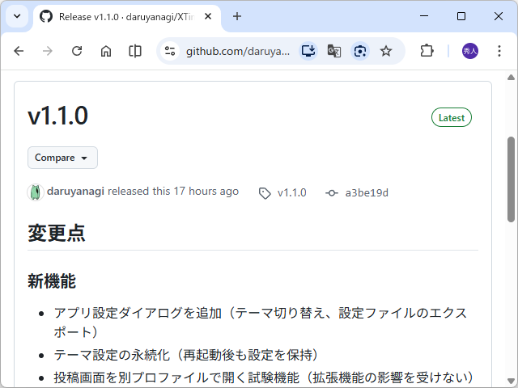

XTimelineViewer v1.1.0 をリリースしました。

[Release v1.1.0 · daruyanagi/XTimelineViewer](https://github.com/daruyanagi/XTimelineViewer/releases/tag/v1.1.0)

変更点は以下の通り。GitHub のリリースノートは Claude 任せなので、こっちの方が正しいというか、人間が意図して行った変更が反映されています。

- 新機能
    - アプリ設定ダイアログを追加（テーマ切り替え、設定ファイルのエクスポート）
    - 投稿画面を別プロファイルで開く試験機能（タイムラインを自動更新する拡張機能とバッティングして編集中の投稿が消える問題を解決できるが、X へのサインインを 2 回しなければならない。個人的にあまり気に行ってないので、今後削除するかもしれない）
    - タイムラインヘッダーのダブルクリックで、元の URL へ戻るように。実質はリロード（再読み込み）として機能するが、ナビゲーションを重ねて元の URL へ戻れなくなったときのリセットとしても便利（ハードリセット）
- バグ修正
    - タイムラインをドラッグ＆ドロップで入れ替えた後、タイムラインが灰色になったまま元に戻らない問題を修正

実装はすべて Claude にやってもらったので、自分はなにも苦労していません。楽な時代になったもんですね。でも、中身を読むとすごい力技で、エレガントではない気がするので、そのうち自分でコードを書くかも