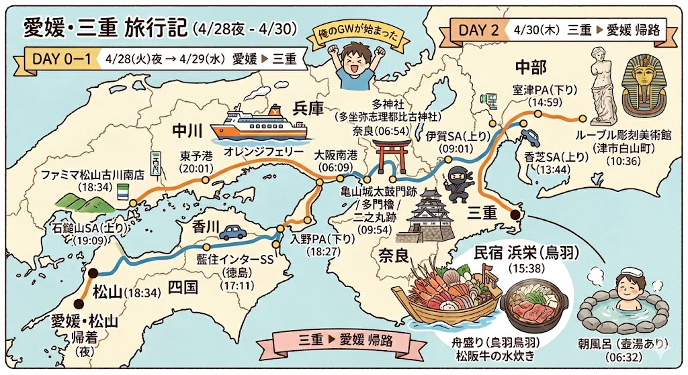

今年の GW は旧友の N 氏と亀山・鳥羽へ出かけた。オレンジフェリーで東予から南港に向かい、明朝、奈良県田原本町で合流。



松阪牛の水炊きの店を予約していたが、時間が余ったので亀山を散策した。



城跡を一周したが、よい雰囲気だった。わざわざ移住したいとまでは思わないが、ここに生まれたら一生住んだだろう。ただ、歴史博物館が休館だったのは残念だった。リニューアルにつき、長期間閉じているらしい。



松阪牛の水炊きは期待以上のおいしさ。あえてステーキやすき焼きを選ばなかったが、これが正解で、お姐さんに一枚一枚丁寧に茹でていただきながら、おいしい野菜と一緒に堪能した。下で肉のうまみを存分に楽しみつつも、脂を受け付けない中年の胃袋にもしっかりとおさまるアッサリさがよい。〆は雑炊にしてもらったが、これは夕飯対策でもある。消化よく食べて、胃袋に余地を作る。



昼から波止場に移動し、海の博物館を見学した。鳥羽の海の民の文化に触れることができる。倉庫に所狭しと並べられた舟は圧巻。カフェのヤマモモサイダーも美味しかった。



投宿は漁師宿で。船盛を追加するなど、少し豪華にしてみたが、あやうく食べきれないほどだった。今は鯛が旬のようで、数種類を食べ比べる機会に恵まれた。自分はコショウダイが好み。これは愛媛でも食べられるが……。

お風呂も適度に広く、外にはかわいい壺湯もあった。家族で露天風呂を借りることもできたようだが、それはまたの機会に。雨のにおいが充満した朝、起きたてに入る風呂は格別だった。朝食も、前日のイセエビでだしをとったみそ汁と一緒に、ごはん三杯いただいた。



帰りは少しお疲れモードだったので、軽く榊原温泉のルーブル彫刻美術館に寄るだけにした。近鉄電車からもよく見える、ミロのビーナスやらサモトラケのニケやらが置いてある妖しい美術館である。

ここにおいてある彫刻はたぶんほぼすべて偽物だが、偽物もここまで大量に集めれば逆に価値がある。古代シュメール・アッカドから中世キリスト教、ルネサンス、フランス革命、現代まで、世界の逸品を十分楽しんだ。