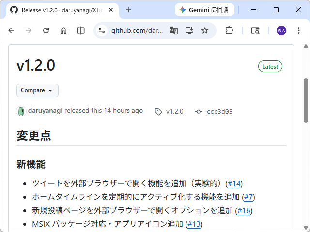

XTimelineViewer v1.2.0 をリリースしました。

[Release v1.2.0 · daruyanagi/XTimelineViewer](https://github.com/daruyanagi/XTimelineViewer/releases/tag/v1.2.0)

変更点は以下の通り。アプリアイコンは Claude ではなく Gemini にお願いしました。縦に並ぶさまざまなタイムラインをイメージした背景に X のロゴを配しています。

- 新機能
    - ツイートを外部ブラウザーで開く機能を追加（実験的、あまり気に入ってはいないけど）
    - ホームタイムラインを定期的にアクティブ化する機能を追加。これがないと XTimelineLoader がホームタイムラインを自動更新してくれないことがある？
    - 新規投稿ページを外部ブラウザーで開くオプションを追加
        - 別プロファイルで投稿を開く機能を非推奨化。もう不要だと思う
    - MSIX パッケージに対応、アプリアイコンを追加
- バグ修正
    - Ctrl+N をどこからでも動作するよう修正
    - 投稿画面の体裁が崩れる問題を修正
- その他
    - 設定ダイアログにバージョン情報と Issue 報告リンクを追加



<ms-store-badge
	productid="9P308HB5BLJ1"
	productname="XTimelineViewer"
	window-mode="direct"
	theme="auto"
	size="large"
	language="ja"
	animation="on">
</ms-store-badge>

Microsoft Store への公開も自動化しようと CI を組んでいたのだけど、ここでかなりハマった。



とりあえず今回は手動で登録して、次回は CI を回せるようにしようと思う。

## 追記（05/03）

多言語対応と Microsoft Store への提出自動化のテストを実施



ストアアプリ版でも多言語対応が動くかはちょっと不安だけど、まぁ、様子見。

パッケージング化されているかいないかで結構動きが違うんだね……こけたところを逐一 Claude にもメモしておかないといけない