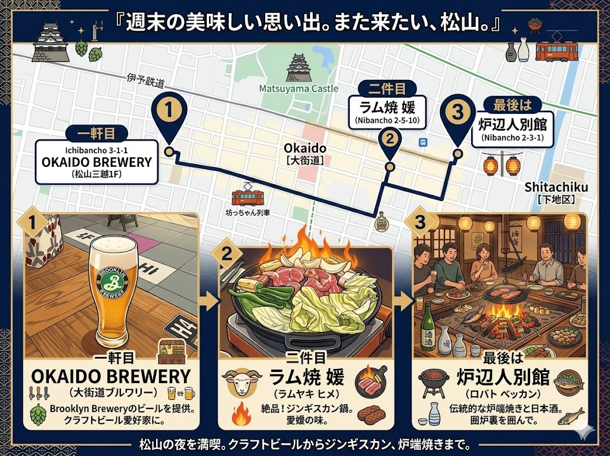

金曜日の晩は、6 人ぐらい集まって飲み会に行った（画像は Nano Banana 2 に作ってもらったイメージです）。

ゼロ次会は三越の一階で地ビール。ここで 3 人集結。



メインは生ラム肉を出してくれるというお店。最近できたのかな？



小さいお店で、6 人は少し多すぎたかもだけど、4 人用のテーブルとカウンター 2 人分をあけてもらった。塩タンとハラミしか食べられなくなった自分でも、生ラム肉だったらいくらでも食べられそうだ。美味しかった。

二次会は、適当な居酒屋に入った。

タッチパネルで注文するシステムだったが、カワハギの刺身が 0 円だったのでノリで頼んでみた……ら、まぁ、当たり前に時価だった（そりゃそうだ

その分は自分の懐から出し、タクシー代はみんなにもってもらって帰った。

なんの話をしたか忘れたけど、オープンソースプロジェクトの運用についてとか、みんなの AI の活用だとか、近況の報告だとか、そんなことをしたような記憶がある。