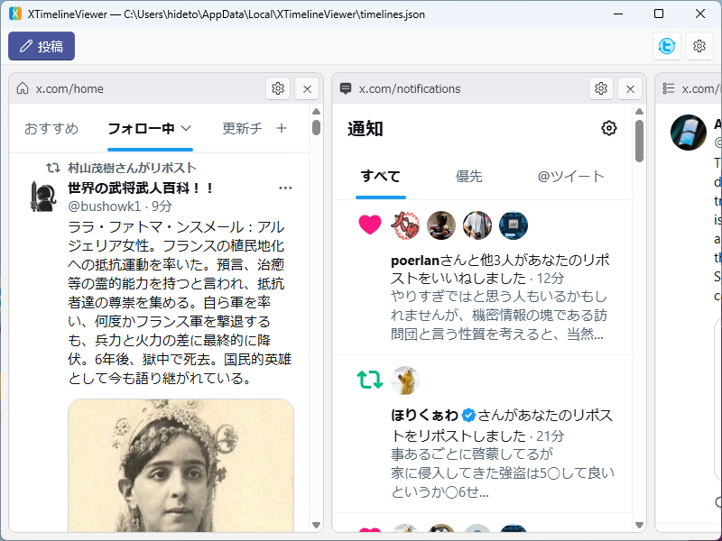
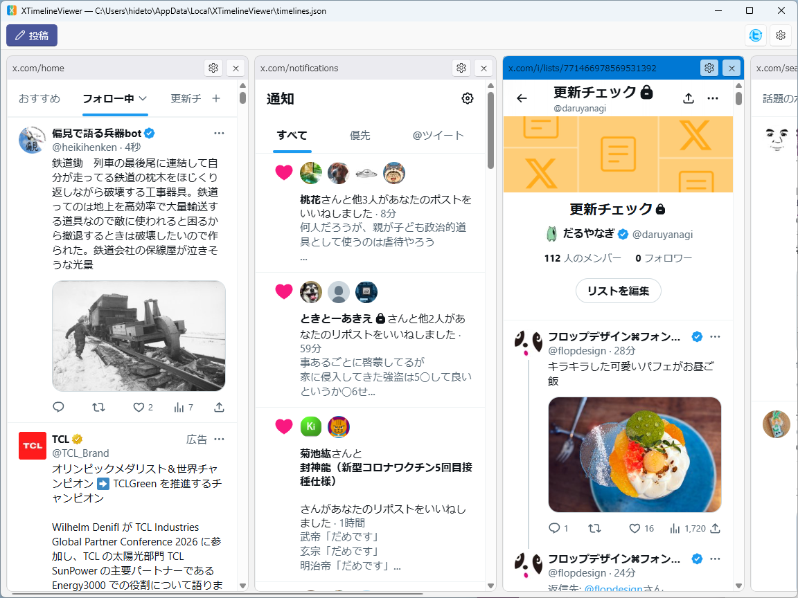
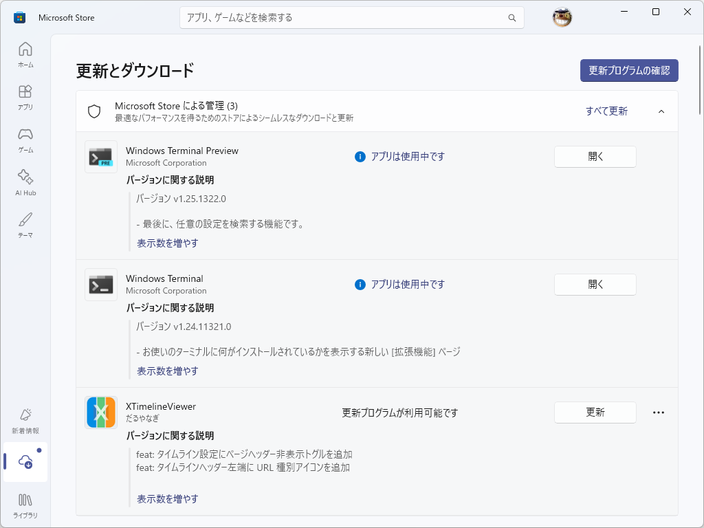
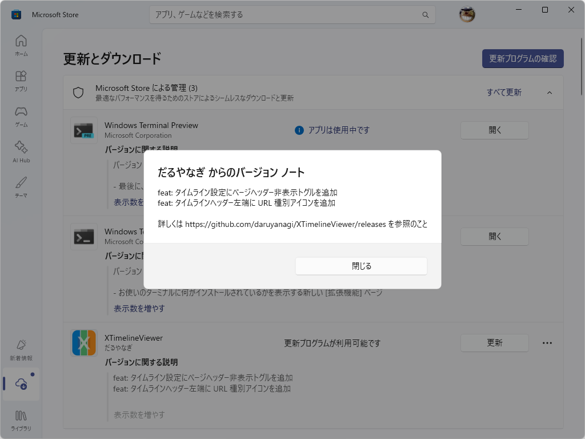

* feat: タイムライン設定にページヘッダー非表示トグルを追加 by @daruyanagi in https://github.com/daruyanagi/XTimelineViewer/pull/34 https://github.com/daruyanagi/XTimelineViewer/pull/38
* refactor: HideHeader を HideSidebar に改名 by @daruyanagi in https://github.com/daruyanagi/XTimelineViewer/pull/35
* feat: タイムラインヘッダー左端に URL 種別アイコンを追加 by @daruyanagi in https://github.com/daruyanagi/XTimelineViewer/pull/37

タイムラインのヘッダーを隠せるようにしたのが目玉機能かな？

通知、リスト、検索、プロフィールなどのタイムラインで機能します。不要なコントロールを隠したり、少しでも多くの投稿を表示したいときに役立ちます。

これに伴い、既存の「ヘッダーを隠す」オプションは、より分かりやすく「サイドバーを隠す」みたいな名前にしました。

そのせいで、**設定が初期化（無効）されています**。ごめんなさい。

あと、 v1.2.x でリリースの自動化をいろいろ試していました。

- GitHub Releases： [Releases · daruyanagi/XTimelineViewer](https://github.com/daruyanagi/XTimelineViewer/releases) ZIP 形式でダウンロードできます
- winget：ZIP 形式を申請中です
- Microsoft Store：[XTimelineViewer](https://apps.microsoft.com/store/detail/9P308HB5BLJ1?cid=DevShareMCLPCS) 自動化をあきらめて、 msix 形式を手動で申請しています。メジャー、マイナーアップデートのみの更新です

どっちでも好きなほうをどうぞ。

[リリースの各種自動化 · Issue #31 · daruyanagi/XTimelineViewer](https://github.com/daruyanagi/XTimelineViewer/issues/31)

## 追記（2026-05-16 15:30）

Microsoft Store への申請が通りました。たぶんそのうち自動でアップデートされます。

バージョンノートも書きました。これはめんどくさいので、CLI で簡単にできないか研究するつもり。