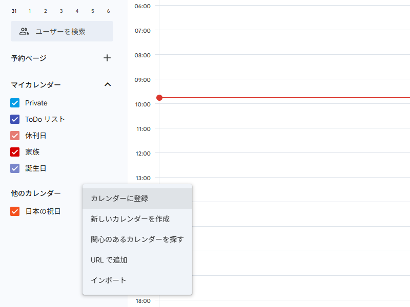
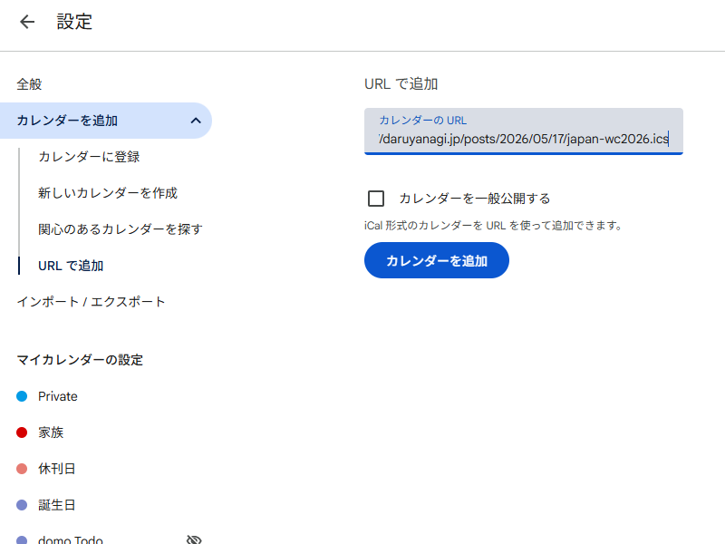
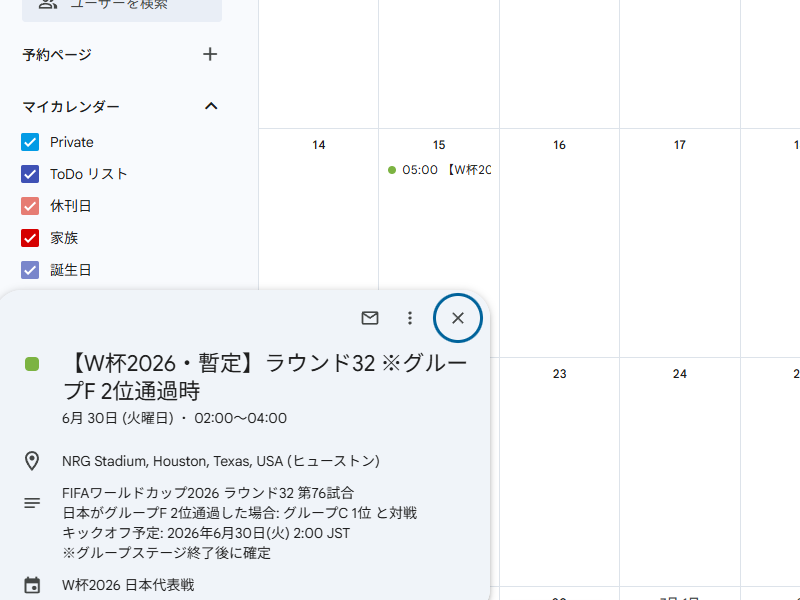

ワールドカップ 2026 の日本代表メンバーが発表された。

三苫の怪我快癒を祈念して代表のユニフォームを買ったのに、結局、選に漏れて泣いている。実のところ、あわよくば決勝とまでいかずとも、そこそこよいところまでイケるのではないかと期待していたが、相当難しくなったのでは。メンバーにしても、FW を削るか、長友の代わりに森田を入れないとボランチが不足しないか心配だが……もう決まったことなので、だれが要る、要らないの話はキッパリとやめて、応援に集中することにする。

というわけで、日本代表のスケジュールだけ iCal にした。これを Google カレンダーなんかに登録しておけば役に立つはず。

[japan-wc2026.ics](japan-wc2026.ics)

## 追加方法

https://calendar.google.com/calendar/ にアクセス

「他のカレンダー」から以下の URL を追加

https://daruyanagi.jp/posts/2026/05/17/japan-wc2026.ics

バックグラウンドで読み込みが開始される。今のところ、ラウンド 32 までのスケジュールを入れているが、これはめでたくグループステージを突破したら更新するつもり。URL を参照していれば、いずれ自動で更新される。

最後に、これを作って、インストール方法まで丁寧に教えてくれた Claude、ありがとう。