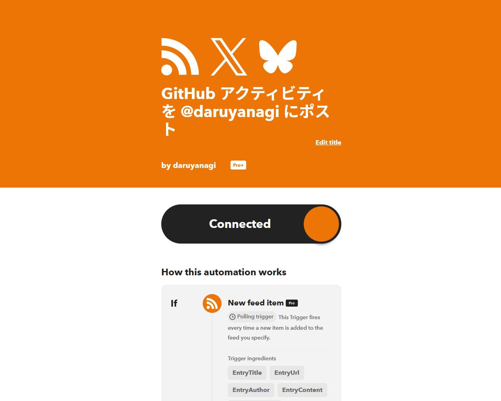
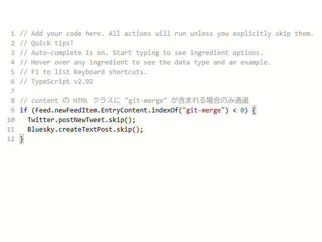



こんな感じで、GitHub のアクティビティを取得して、IFTTT で X や Bluesky へ投稿できるようにする。

## 必要なもの

- RSS：`https://github.com/{username}.atom`
- IFTTT アカウント：X への投稿には Pro プランが必要

## 手順



1. IFTTT でアプレットを新規作成する
2. トリガーに **RSS Feed → New feed item** を選択し、URL に `https://github.com/{username}.atom` を入力する
3. アクションに X（Twitter）や Bluesky などの投稿アクションを追加する
4. **Filter code** を開き、以下のスクリプトを記述する

```javascript
if (Feed.newFeedItem.EntryContent.indexOf("git-merge") < 0) {
  Twitter.postNewTweet.skip();
  Bluesky.createTextPost.skip();
}
```



`git-merge` が含まれないエントリーは `skip()` でスキップされるため、プルリクのマージだけが通知される。

ほかにも、`Feed.newFeedItem.EntryContent`で以下のアクティビティがフィルタリングできるようだ（他にもあるかもしれない）。お好みで選んでどうぞ。

| クラス | アクティビティ |
|---|---|
| `git-merge` | プルリクのマージ |
| `repo-push` | プッシュ |
| `git-branch` | ブランチの作成・削除 |
| `issues_closed` | イシューのクローズ |
