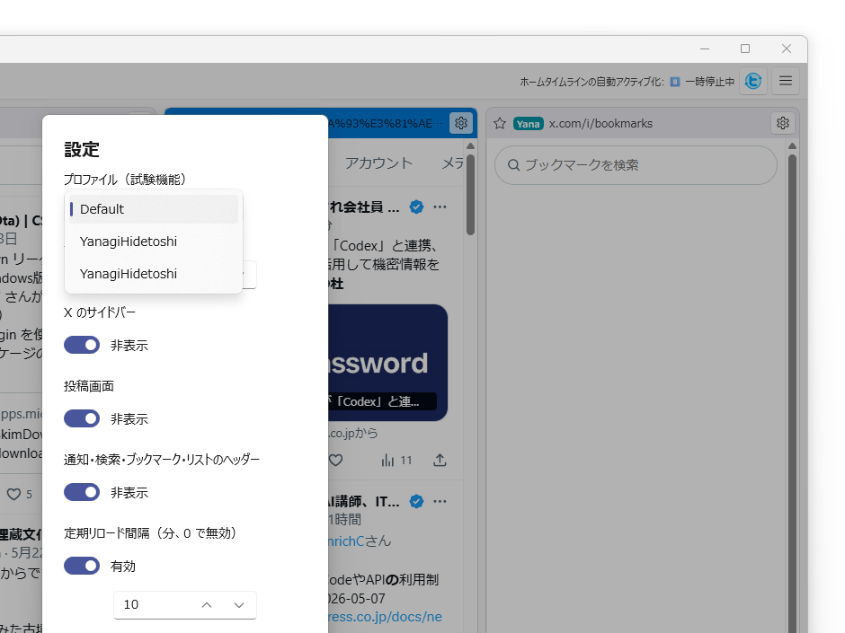
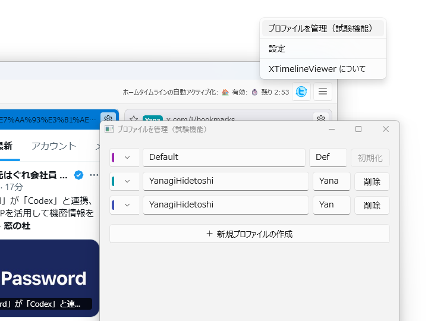
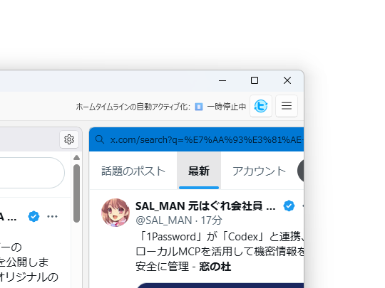
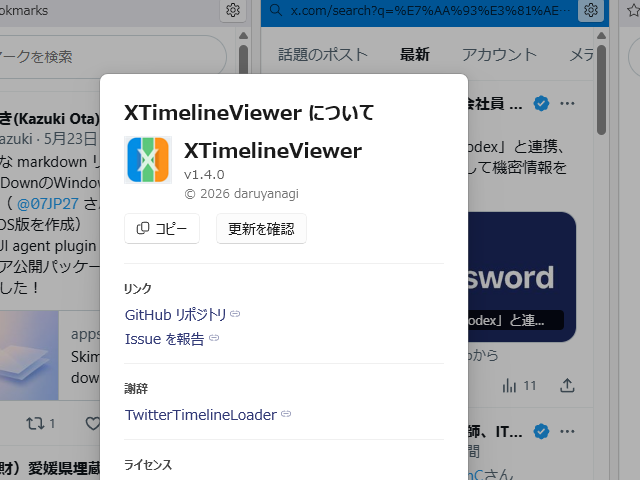
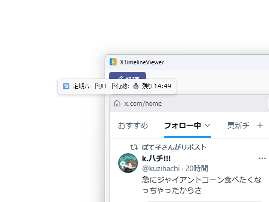
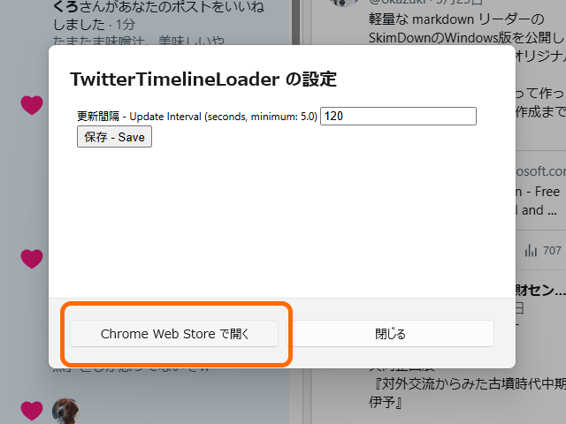

v1.4.0 をリリースしました。目玉機能はマルチプロファイル対応ですが、まだ試験機能という扱いです。こまごま不具合があるので、使いたい人だけどうぞ。既知の問題はイシューをチェックしてください。

## v1.3.1 → v1.4.0（winget / ZIP ユーザー向け）

- マルチプロファイル対応（試験機能） — 複数の X アカウントを切り替えて利用可能に。プロファイルの作成・管理・削除、タイムラインごとのプロファイル切り替え、色付きバッジ表示に対応
- タイムスタンプリンクを外部ブラウザーで開く オプションを追加（試験機能）
- OpenTweetInBrowser を廃止 — 上記のタイムスタンプリンクオプションに置き換え

ZIP 版は winget でアップデートしてください。

## v1.3.0 → v1.4.0（Microsoft Store ユーザー向け）

MSIX/Microsoft Store を利用している人は、v1.3.0 からのバージョンアップになると思います。申請は済ませているので、そのうち公開されるはず。

変更点は上記に加えて:

- ホームタイムラインの自動アクティブ化機能を改善 — 指定間隔でホームタイムラインを自動的にアクティブ化。操作中・ダイアログ中・フォーカス中は一時停止。ツールバーにタイマー状態を表示
- About ダイアログに更新チェック機能を追加 — winget / GitHub / Microsoft Store からのアップデートを確認可能に
- 定期ハードリロードの改善 — タイムラインごとに個別設定、ホームタイムラインにも対応、ポインター乗せ中・URL 離脱中の一時停止、ツールチップに状態表示
- UI の整理 — 設定ボタンをハンバーガーメニューに変更、About ダイアログを Fluent 2 デザインにリニューアル、タイムラインの閉じるボタンを設定ダイアログに移動、設定ファイルパスを設定ダイアログに移設
- 拡張機能設定ダイアログの改善 — ホームページ・Chrome Web Store リンクを追加
- 言語切り替えの安定性向上 — COMException / InvalidOperationException の修正

 

簡単な自動更新機能を付けて、ホームタイムラインの自動アクティブ化、定期ハードリロードなど、タイマーを使う処理をちょっと整理しました。AI に任せると割と力業で機能をはやしてくれるのですが、そろそろ人間が整理しないといけないなぁって感じですね。