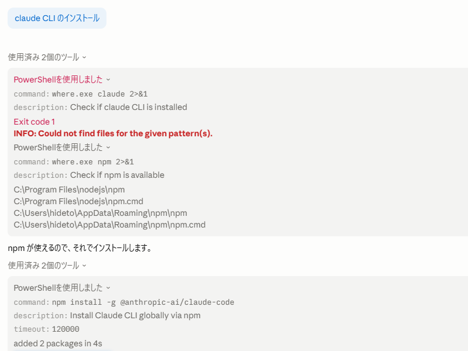

[Microsoft 公式の WinUI agent plugin で WinUI 3 アプリ開発がぐっと楽になった話](https://zenn.dev/microsoft/articles/winui-agent-plugin) を読んで。とても便利そうなので、さっそく自分のところにもインストールしてみた。もちろん、自分でやるわけがない。Claude アプリにやり方を聞いたら Claude CLI を入れろだの、Node/npm が必要だのと面倒くさいことを言うので、すべてそのままぶん投げた。

そうしたら、WinUI agent plugin もそのままセットアップしてもらえた（ラッキー！）。ただし、Claude Code のセッションは作り直さなきゃいけなかった。最近はこういうことすらめんどくさい。

さっそく、開発中の [XTimelineViewer](https://daruyanagi.jp/tags/xtimelineviewer/) で修正すべき点を尋ねてみたら、まさしく「いずれやらなきゃいけないなぁ」と思っていたことがすべて列挙された。



これは便利だな。素の Claude Code はほっといたら MainWindow.cs にすべてコードビハインドでべた書きする。そのためコード行が何千にも達していて、そろそろ MVVM へのリファクタリングが必要だったが……それもすべて AI 任せにできそう。

とりあえず、これからやるべきことを指摘してもらって、それをそのままイシューにした。

自分は Claude のプランモードを使うよりも、いったんイシューにしてもらう方が好きだ。ディスプレイに書かれたテキストを校正するときはすり抜けていた誤字脱字も、紙に印刷すれば見つけられる。あの原理で、いったんイシューにしてもらう方が読みやすく、思考の整理もしやすい。修正点はコメントにつけて、あとで Claude に読んでもらえばいい。

ただ、4.6 Opus では「コメントまで全部読んで」と言わないと、イシューの最初の投稿しか読まないみたいだ。気が利かない。でも、それも「次からはちゃんと読んで」とでも言っとけば、ちゃんとメモリに記録して忘れないようにする。つくづくえらいと思う。
