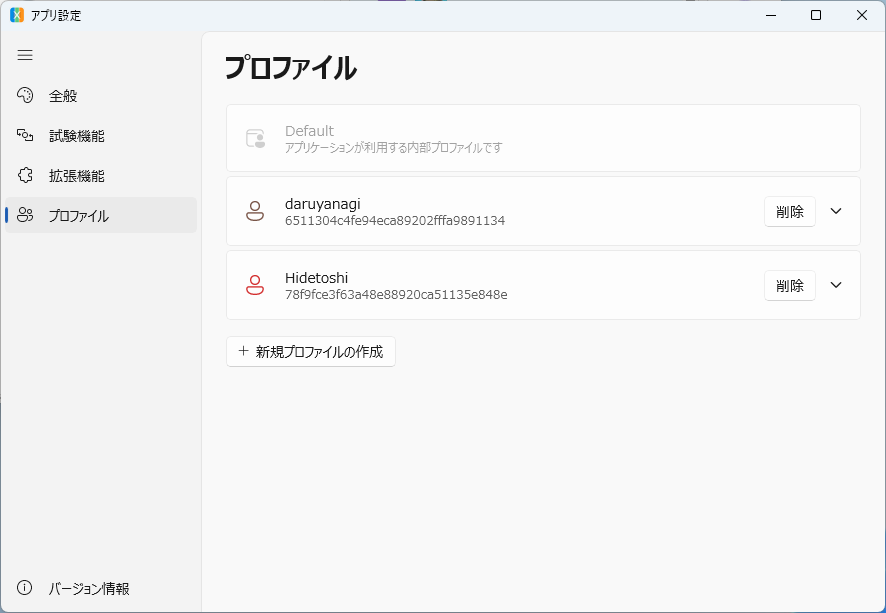
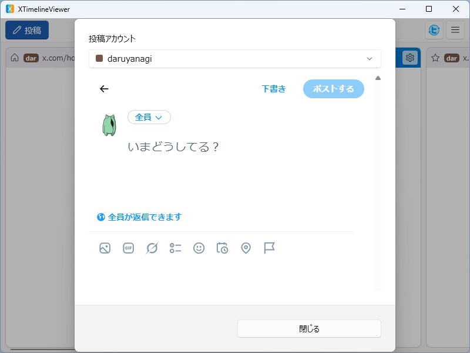
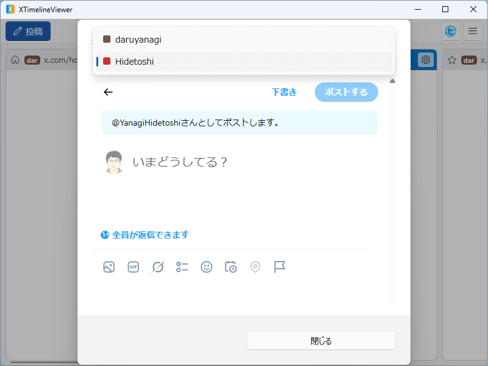
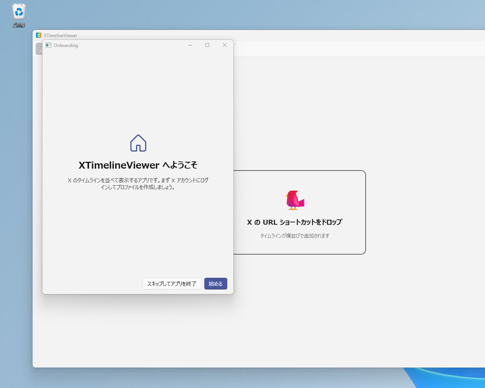
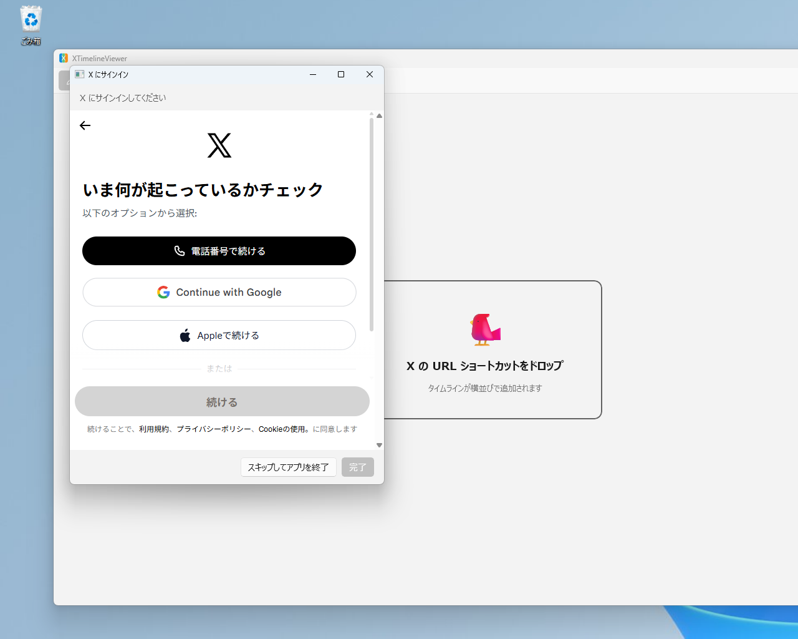
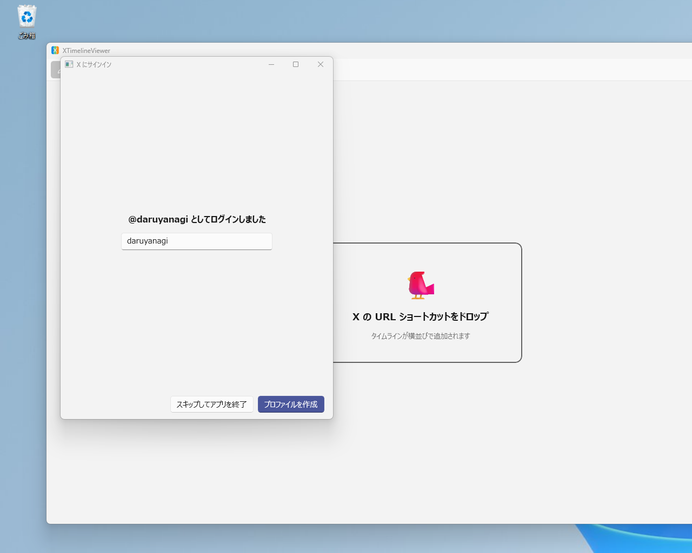
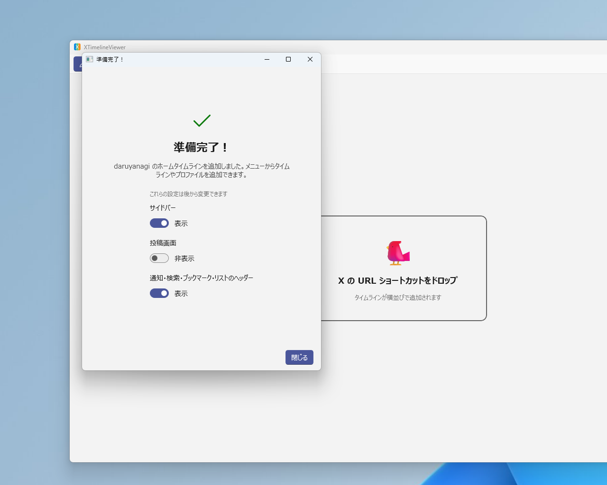
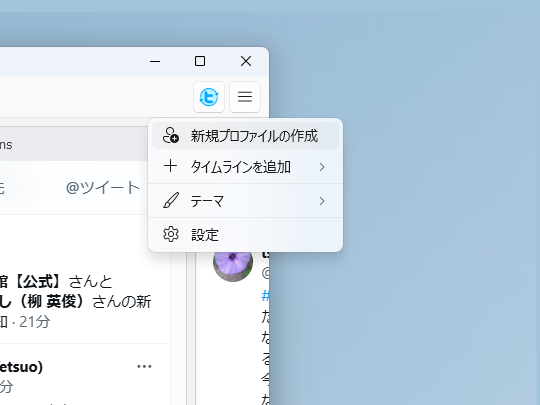
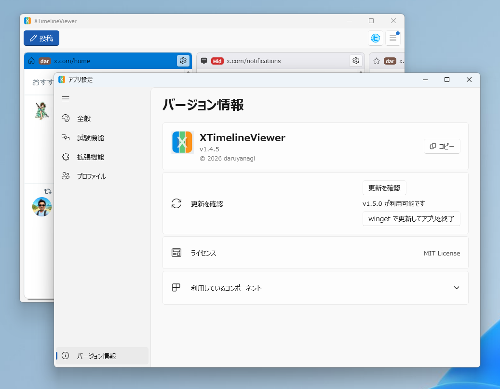
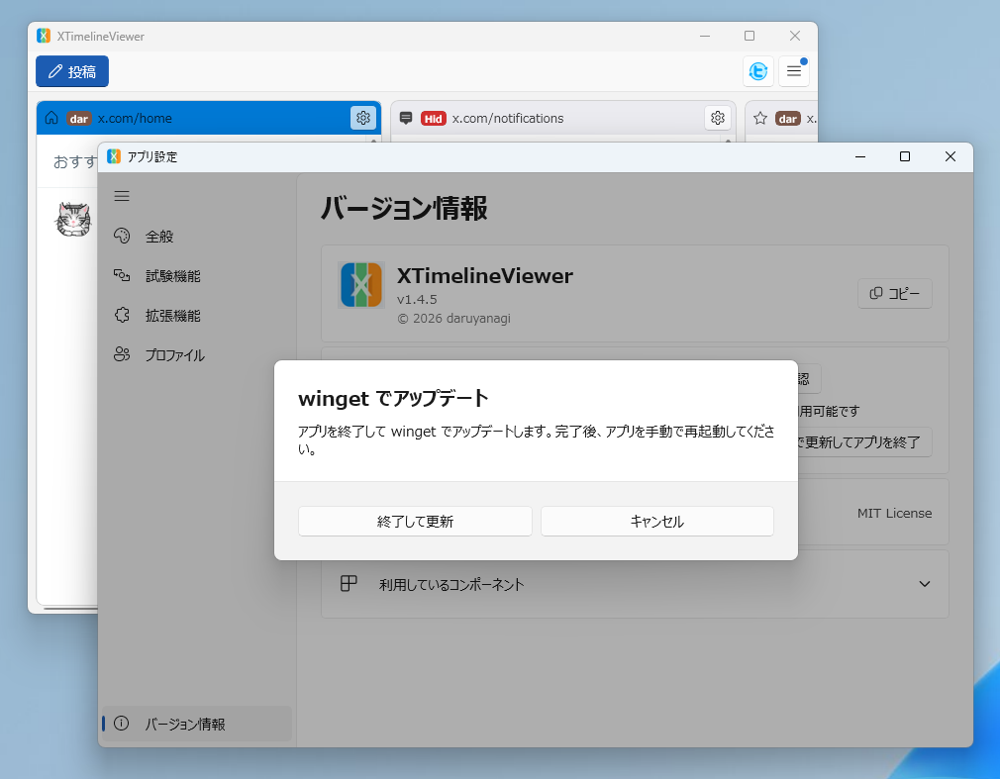

[XTimelineViewer](https://github.com/daruyanagi/XTimelineViewer) の v1.5.0 をリリースしました。v1.4.0（マルチプロファイル対応）から約 2 週間、かなりの量の変更が入っています。

## 新機能

目玉は **マルチプロファイル（マルチアカウント）対応の正式リリース** です。v1.4.0 でイケてなかった部分をだいぶ直しました。

### 設定ウィンドウの全面刷新（[#132](https://github.com/daruyanagi/XTimelineViewer/issues/132)）

設定ウィンドウをゼロから再設計しました。プロファイル管理ダイアログやバージョン情報ダイアログの統合、ナビゲーションペイン、Windows 11 準拠のデザイン（[SettingsCard](https://learn.microsoft.com/ja-jp/dotnet/communitytoolkit/windows/settingscontrols/settingscard)）……だいぶ使いやすくなったのではないでしょうか。

> [!WARNING]
> これにともない、追加でのサインインが必要になることがあります。ごめんなさい
>
> これまで利用してきた既存のメインプロファイル（default）は、今後アプリケーションが内部的に利用するようになります。使い続けることはできないこともないですが（できるだけそのように設計しました）、カスタマイズやなにやらするには「名前付きプロファイル」を新しく作成していただくことになります



### 投稿画面にプロファイル選択プルダウンを追加（[#156](https://github.com/daruyanagi/XTimelineViewer/issues/156)）

投稿ダイアログでプロファイルを選べるようになりました。





マルチプロファイル対応したのならばぜひほしい機能ですよね！

### オンボーディングエクスペリエンス（[#174](https://github.com/daruyanagi/XTimelineViewer/issues/174)）

オンボーディングエクスペリエンスとは、要するに初期設定です。最初のプロファイルを追加します。







### タイムラインの既定表示オプション（[#27](https://github.com/daruyanagi/XTimelineViewer/issues/27)）

オンボーディングエクスペリエンスの最終ステップには、タイムラインの既定表示オプションを指定できます。



次回、新しいタイムラインを追加したときに適用される表示オプション（サイドバー・投稿画面・リストヘッダーの表示/非表示）をあらかじめ設定できます。

あとから設定画面で変更することもできます。

マルチプロファイル対応に関連する新機能はここまで。以下はちょっとした改善です。

### ハンバーガーメニューからタイムラインを追加（[#120](https://github.com/daruyanagi/XTimelineViewer/issues/120)）

ハンバーガーメニューからタイムラインを追加できるようになりました。



今はホーム、通知、ブックマークだけかな？　いずれは検索タイムラインも追加できるようになりたいですね。もちろん、URL のドラッグ＆ドロップで追加する機能も健在です。リストなんかはそっちでやった方が早いですね。

### UI 言語設定を再起動なしで即時反映（[#117](https://github.com/daruyanagi/XTimelineViewer/issues/117)）

これまでは言語を変更すると再起動が必要でした。地味に便利な改善です。

## バグ修正

- **投稿完了後にダイアログが自動で閉じない**（[#180](https://github.com/daruyanagi/XTimelineViewer/issues/180)）— X の SPA 遷移に対応し、CreateTweet API の成功レスポンスを検知して自動クローズするように修正しました
- **プロファイルバッジの色が起動のたびに変わる**（[#160](https://github.com/daruyanagi/XTimelineViewer/issues/160)）
- **ブックマークタイムラインでヘッダーを隠すと最初の投稿まで隠れてしまう**（[#115](https://github.com/daruyanagi/XTimelineViewer/issues/115)）
- **タイムライン設定ダイアログでウィンドウを縮小すると下部の設定項目にアクセスできない**（[#147](https://github.com/daruyanagi/XTimelineViewer/issues/147)）
- **メニュー・ペインのアイコンが表示されない**（[#122](https://github.com/daruyanagi/XTimelineViewer/issues/122)）— あわせてメニュー全体のアイコンを整備しました

## UI/UX 改善

- **プロファイル削除ボタンを Expander 内に移動**（[#178](https://github.com/daruyanagi/XTimelineViewer/issues/178)）— 展開矢印の隣にあった削除ボタンが誤操作を招きやすかったので、展開内の末尾に移動しました
- **タイムライン追加時に default プロファイルが自動で割り当てられる**（[#166](https://github.com/daruyanagi/XTimelineViewer/issues/166)）
- **拡張機能設定ダイアログに明暗テーマが適用されていなかった**（[#126](https://github.com/daruyanagi/XTimelineViewer/issues/126)）

## 内部改善・リファクタリング

- 自動更新チェックを winget ベースに簡素化（[#171](https://github.com/daruyanagi/XTimelineViewer/issues/171)）
- プロファイル作成フローを共通化してオンボーディングの土台に（[#157](https://github.com/daruyanagi/XTimelineViewer/issues/157)）
- MainWindow 関連ファイルを Views フォルダーに移動（[#128](https://github.com/daruyanagi/XTimelineViewer/issues/128)）
- Edge Dev 依存を除去（[#124](https://github.com/daruyanagi/XTimelineViewer/issues/124)）
- テーマ・言語切り替えの UI テストを追加（[#113](https://github.com/daruyanagi/XTimelineViewer/issues/113)）
- MainWindow partial class からサービスクラスを抽出（[#108](https://github.com/daruyanagi/XTimelineViewer/issues/108)）
- 未使用の RestartRequired リソースキーを削除（[#119](https://github.com/daruyanagi/XTimelineViewer/issues/119)）

## ビルド・配布

- Microsoft Store 提出の自動化を再構築（[#150](https://github.com/daruyanagi/XTimelineViewer/issues/150)）— 正規バンドル生成＋提出後の検証も自動化しました
- winget 申請の Validation-Installation-Error を修正（[#131](https://github.com/daruyanagi/XTimelineViewer/issues/131)）

---

インストールは [GitHub Releases](https://github.com/daruyanagi/XTimelineViewer/releases/tag/v1.5.0) か winget からどうぞ。

```
winget install daruyanagi.XTimelineViewer
```

winget でインストールすると、次回からはアプリ内からアップデートできます。





Microsoft Store からインストールした場合は、Store が自動で更新の面倒を見てくれるはずです。
