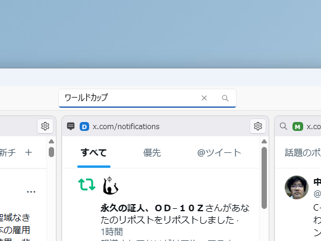
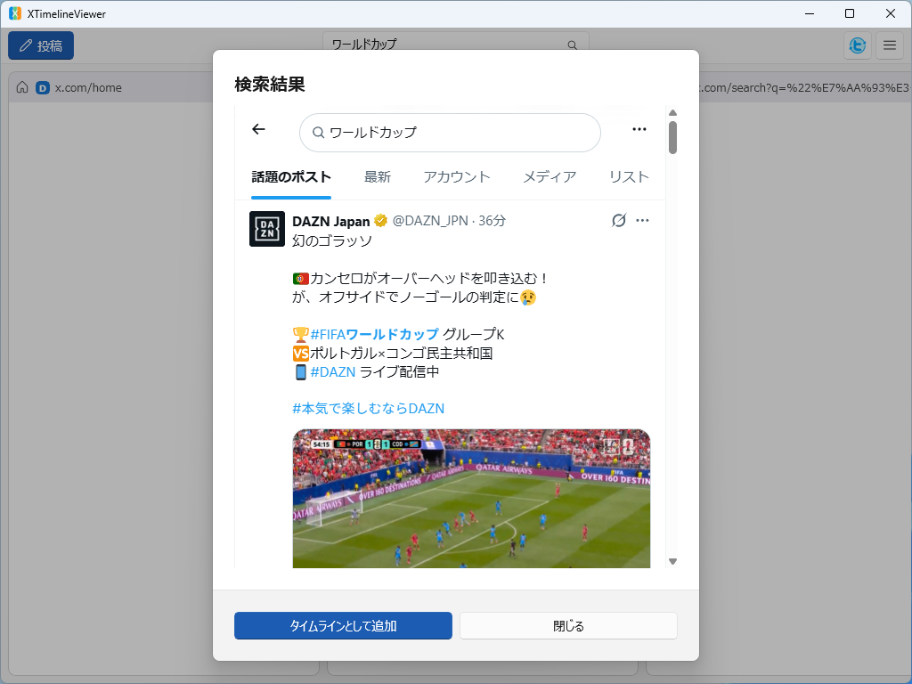
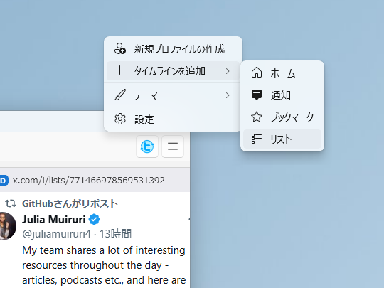
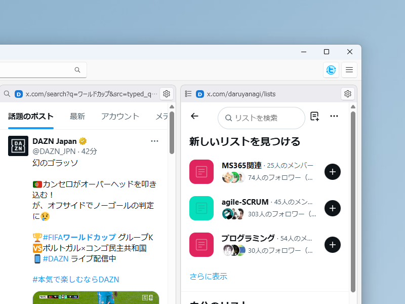
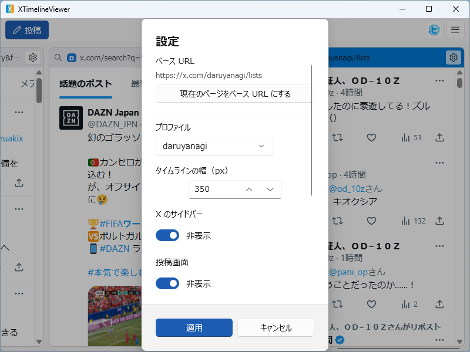
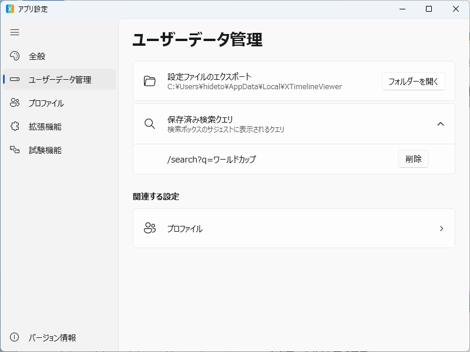

[XTimelineViewer](https://github.com/daruyanagi/XTimelineViewer) の v1.6.0 をリリースしました。v1.5.0 から 1 週間ほど、目玉は **検索機能** です。

## 新機能

### ツールバーの検索ボックス（[#182](https://github.com/daruyanagi/XTimelineViewer/issues/182)）

ツールバーの中央に検索ボックスを追加しました。クエリを入力すると X の検索結果がダイアログで表示され、タブ（最新・ユーザー・メディアなど）の切り替えやクエリの編集もそのままできます。



気に入った検索結果は「タイムラインとして追加」でフィルター込みのまま固定できます。`Ctrl+F` / `F3` でどこからでも検索ボックスにフォーカスできるようにしました（これにともない、いいねのショートカットは `Ctrl+L` に変更しています）。



入力したクエリはサジェストとして保存され、次回以降の入力時に候補として表示されます。保存されたクエリは、後述の「ユーザーデータ管理」ページで削除できます。

### 「タイムラインを追加」にリスト（[#190](https://github.com/daruyanagi/XTimelineViewer/issues/190), [#211](https://github.com/daruyanagi/XTimelineViewer/issues/211)）

メニューの「タイムラインを追加」からリスト一覧を追加できるようになりました。



### タイムラインのベース URL を固定（[#189](https://github.com/daruyanagi/XTimelineViewer/issues/189)）

しかし、これだとリスト一覧がカラムとして追加されます。ここからさらに好みのリストを選んで、それを表示しておきたいですよね。



そこで、「ベース URL」という概念を導入しました。ヘッダーのダブルクリックで戻ってこられる URL です。ペイン設定の「現在のページをベース URL にする」で、そのページを次回以降の起点に固定できるようになっているので、好みのリストをカラムに表示しておくことができます。



もちろん、リスト以外のタイムラインでも使えます。適当にナビゲーションして、ここで固定したいと思ったときに使ってください。

### 設定に「ユーザーデータ管理」ページを新設（[#187](https://github.com/daruyanagi/XTimelineViewer/issues/187)）

設定ファイルのエクスポートと、保存済みの検索クエリを「ユーザーデータ管理」ページに集約しました。保存済みクエリは個別に削除できます（[#184](https://github.com/daruyanagi/XTimelineViewer/issues/184)）。



## 改善

- 検索タイムラインのヘッダー URL を読みやすくデコード表示するようにしました
- **多言語対応を MRT Core ベースに刷新**（[#198](https://github.com/daruyanagi/XTimelineViewer/issues/198)）— 言語切り替え（システム⇔日本語⇔ English）の不具合を修正しました
- 設定ページを MVVM 化し、保守性とテスト容易性を向上させました（[#199](https://github.com/daruyanagi/XTimelineViewer/issues/199)）

## 内部改善・リファクタリング

- Models の分割・純粋ロジックの抽出・未使用リソースの削除
- ユニットテストを拡充（21 → 113 件）

---

インストールは [GitHub Releases](https://github.com/daruyanagi/XTimelineViewer/releases/tag/v1.6.0) か winget からどうぞ。

```
winget install daruyanagi.XTimelineViewer
```

winget でインストールすると、次回からはアプリ内からアップデートできます。Microsoft Store からインストールした場合は、Store が自動で更新の面倒を見てくれるはずです。
