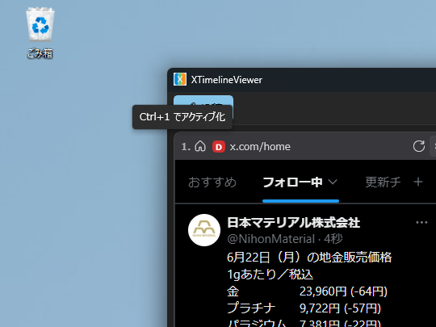
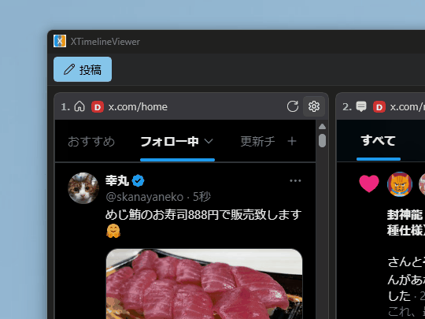

[XTimelineViewer](https://github.com/daruyanagi/XTimelineViewer) の v1.7.0 をリリースしました。v1.6.0 から数日、今回はキーボードによるフォーカス移動の改善と、ホームタイムライン自動更新の内製化が中心です。

## 新機能

### タイムラインの番号バッジと Ctrl+数字でフォーカス切り替え（[#225](https://github.com/daruyanagi/XTimelineViewer/issues/225), [#226](https://github.com/daruyanagi/XTimelineViewer/issues/226)）

タイムラインに左から順に番号（1, 2, 3, …）を割り当て、ヘッダーに番号バッジを表示するようにしました。`Ctrl+1`〜`Ctrl+9` で対応するタイムラインへ一発でフォーカスを切り替えられます。番号バッジにマウスを乗せると、そのタイムラインをアクティブ化するホットキー（`Ctrl+数字`）がツールチップで表示されます。（[#237](https://github.com/daruyanagi/XTimelineViewer/issues/237)）



これまでは `Ctrl+←` / `Ctrl+→` で隣のタイムラインへ順送りするしかなく、ペインが多いと目的の場所まで何度も押す必要がありました。並び替え（ヘッダーのドラッグ＆ドロップ）後は表示順に合わせて番号を振り直します。

そのほかにも、細かい不具合を修正しました。

- 視界外のタイムラインへは横スクロールして表示（[#231](https://github.com/daruyanagi/XTimelineViewer/issues/231)）
- キーボードショートカットのフォーカス横断対応とドリフト検出（[#227](https://github.com/daruyanagi/XTimelineViewer/issues/227), [#228](https://github.com/daruyanagi/XTimelineViewer/issues/228), [#229](https://github.com/daruyanagi/XTimelineViewer/issues/229)）
- マウスホイールで操作したペインをアクティブ化（[#221](https://github.com/daruyanagi/XTimelineViewer/issues/221)）
- `Ctrl+F` / `F3` のアクセラレータツールチップが UI 全体に出る（[#214](https://github.com/daruyanagi/XTimelineViewer/issues/214)）— v1.6.1 で修正

### ホームタイムラインの自動更新を内製化（[#207](https://github.com/daruyanagi/XTimelineViewer/issues/207)）

これまでホームタイムラインの自動更新は、同梱の Chromium 拡張（TwitterTimelineLoader）で実現していました。これをアプリ側に取り込み、自分で細かく制御できるようにしました。

アイコンで動作状況もわかりやすく表示してみました。



おもな狙いは 2 つです。不具合というか、制御不足なところも修正しました。

- **リプライ・引用の下書きが消える問題への対策** — 拡張側の入力中判定をすり抜けると、更新のためにホームボタンがクリックされて画面遷移し、書きかけのテキストが失われることがありました
- **無駄なタイマーの削減** — 拡張はすべての X のペインに注入され、実際に更新するのはホームだけなのに全ペインでタイマーが回っていました
- ホームでアクション後に自動更新が停止する不具合を解決（[#232](https://github.com/daruyanagi/XTimelineViewer/issues/232)）

これにともない、ホームタイムラインを定期的にアクティブ化する機能は非推奨になりました（[#222](https://github.com/daruyanagi/XTimelineViewer/issues/222)）。ホームタイムラインが自動更新されないことへの対策として入れていた「定期的にアクティブ化」する Hotfix は、あまり効果がなかったため非推奨としました。当面は無効化のうえグレーアウト表示にしてあり、v2.0 で削除する予定です。これでタイマーまわりの複雑なコードをかなり減らせます。

## ビルド・配布

- リリース成果物を一括生成する `Release.ps1` を追加（[#216](https://github.com/daruyanagi/XTimelineViewer/issues/216)）

---

インストールは [GitHub Releases](https://github.com/daruyanagi/XTimelineViewer/releases/tag/v1.7.0) か winget からどうぞ。

```
winget install daruyanagi.XTimelineViewer
```

winget でインストールすると、次回からはアプリ内からアップデートできます。Microsoft Store からインストールした場合は、Store が自動で更新の面倒を見てくれるはずです。
