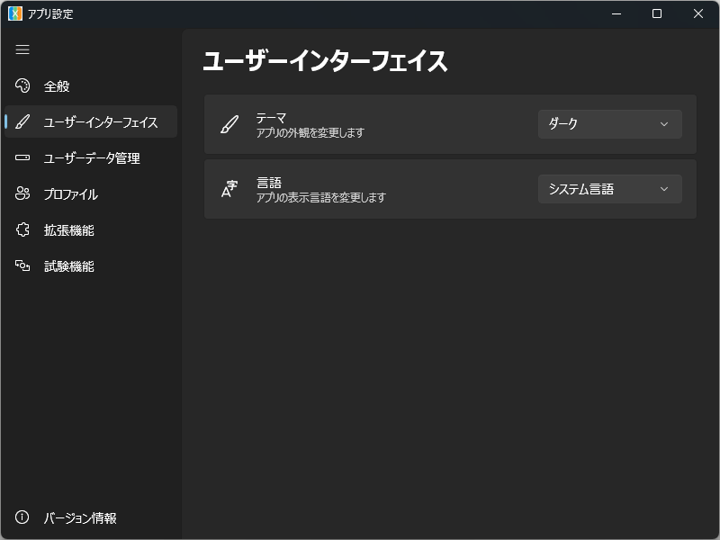
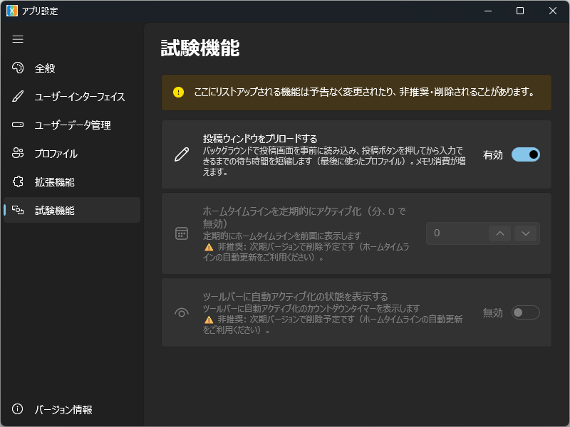
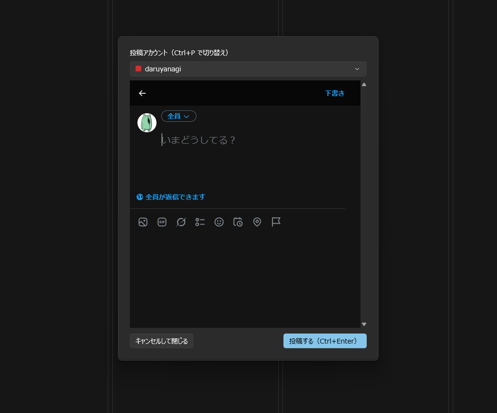

[XTimelineViewer](https://github.com/daruyanagi/XTimelineViewer) の v1.8.0 をリリースしました。今回は設定ページの再編と、投稿ダイアログ（コンポーザー）まわりの大幅な改善が中心です。

## 設定ページの再編

### ［ユーザーインターフェイス］ページを新設（[#236](https://github.com/daruyanagi/XTimelineViewer/issues/236)）

設定が増えてきて［全般］ページがごちゃついてきたので、テーマ・言語を新しい［ユーザーインターフェイス］ページに移しました。ナビゲーションでは［全般］のすぐ下に並びます。



### 試験機能の「卒業」

これまで［試験機能］ページに置いていた外部ブラウザー関連の設定（新規投稿を外部ブラウザーで開く、タイムスタンプリンクを外部ブラウザーで開く、リンクを開くブラウザー、Edge プロファイル）を、正式機能として［全般］の［外部ブラウザー］セクションに集約しました。Edge プロファイルは「リンクを開くブラウザー」の従属オプションとして Expander の中に格納しています。

［試験機能］ページに残るのは、非推奨になった項目（v1.7.0 でグレーアウトした「定期的にアクティブ化」など）だけになりました。

### 設定ページに InfoBar を追加（[#241](https://github.com/daruyanagi/XTimelineViewer/issues/241), [#242](https://github.com/daruyanagi/XTimelineViewer/issues/242)）

拡張機能ページの上部に InfoBar を常設し、拡張が入っていないとき・導入済みのときで文言を出し分けるようにしました。InfoBar のボタンから extensions フォルダーを直接開けます（無ければ作成します）。

［試験機能］ページにも Warning の InfoBar を表示し、「ここにリストアップされる機能は予告なく変更されたり、非推奨・削除されることがあります」と注意を促すようにしました。



## 投稿ダイアログ（コンポーザー）の改善

投稿ダイアログの細部を詰めました（[#246](https://github.com/daruyanagi/XTimelineViewer/issues/246)）。とくにキー操作が改善されており、ショートカットキーを覚えることですばやく操作できるようにしてあります。



- **ボタンを再配置**: 左に［キャンセルして閉じる］（ESC）、右に［投稿する（Ctrl+Enter）］（強調色）。組み込みの「閉じる」ボタンは廃止しました。
- **X 上部バーを非表示**: 戻る・下書き・ポストするボタンを CSS で隠し、投稿の導線をフッターのボタンに一本化しました。
- **ESC で確実に閉じる**: ESC を WebView 内で捕捉して閉じるようにし、X 側に渡すと画面遷移して黒画面になってしまう問題を解消しました。
- **離脱確認の抑止**: 下書きが残った状態で「サイトから移動しますか?」が出ないようにしました。
- **表示時に編集ボックスへフォーカス**: 開いてすぐ入力できるよう、確実にフォーカスが当たるまでリトライします。

### 投稿ウィンドウのプリロード（試験機能・[#244](https://github.com/daruyanagi/XTimelineViewer/issues/244)）

投稿ボタンを押してから入力できるようになるまでの待ち時間を大幅に短縮する **プリロード** を試験機能として追加しました（既定 OFF）。

最後に使ったプロファイルの投稿画面をあらかじめ非表示で完成させておき、投稿ボタンを押したらそれをダイアログに差し替えて即座に表示します。閉じたら下書きをリセットして次回に備えて再び温めておきます。体感はかなり速くなりました！

試験機能なので、［試験機能］ページのトグルから有効化してお試しください。

### Ctrl+P / Ctrl+Shift+P でアカウント切替（[#247](https://github.com/daruyanagi/XTimelineViewer/issues/247), [#252](https://github.com/daruyanagi/XTimelineViewer/issues/252)）

投稿ダイアログ上で `Ctrl+P` を押すと、投稿アカウントを次のプロファイルへ巡回で切り替えられるようにしました。`Ctrl+Shift+P` で逆方向（前のアカウント）へ切り替えます。切り替え後は編集ボックスへフォーカスが戻ります。

「投稿アカウント」ラベルには「（Ctrl+P で切り替え）」と併記して見つけやすくしてあります。

## そのほかの修正

投稿ダイアログでキーボードショートカットの改善を行ったついでに、それ以外のところでもキー操作だけでいろいろできるように改善してあります。

- ホーム自動更新インジケーターの「一時停止中」を理由別に分かりやすく表示（「ホーム以外を表示中」「スクロール中（先頭に戻ると再開）」など）（[#250](https://github.com/daruyanagi/XTimelineViewer/pull/250)）
- マウスホイールでアクティブ化したペインがキーボードショートカットを受け付けない問題を修正（[#251](https://github.com/daruyanagi/XTimelineViewer/issues/251)）
- 個別ツイート（`/status/...`）ページで `Ctrl+R`（リポスト）/ `Ctrl+B`（ブックマーク）/ `Ctrl+L`（いいね）が効くように修正。未選択でも先頭の主ツイートに作用します（[#254](https://github.com/daruyanagi/XTimelineViewer/issues/254)）

---

インストールは [GitHub Releases](https://github.com/daruyanagi/XTimelineViewer/releases/tag/v1.8.0) か winget からどうぞ。

```
winget install daruyanagi.XTimelineViewer
```

winget でインストールすると、次回からはアプリ内からアップデートできます。Microsoft Store からインストールした場合は、Store が自動で更新の面倒を見てくれるはずです。
