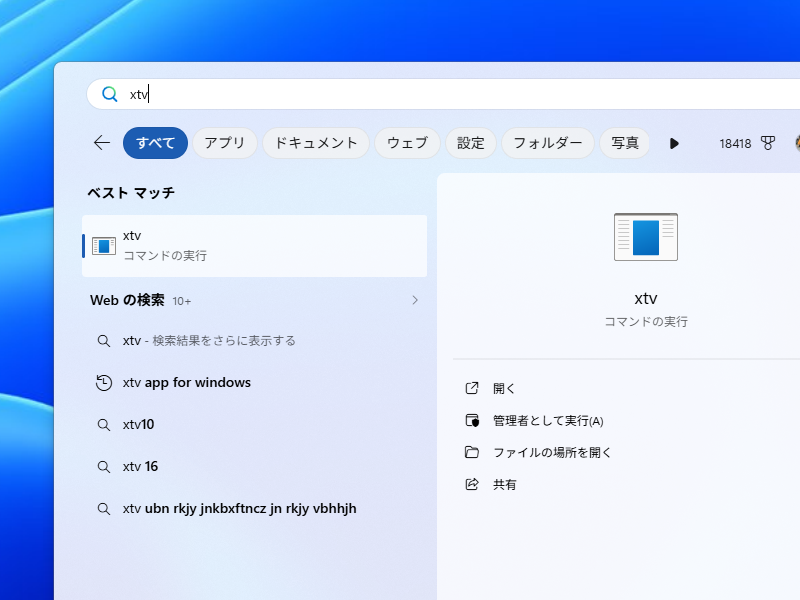

[XTimelineViewer](https://github.com/daruyanagi/XTimelineViewer) の v1.9.0 をリリースしました。今回はコマンドラインからの起動を改善したことと、arm64 端末で起動できない不具合の修正が中心です。あわせて v1.8.1 での修正もまとめて紹介します。

## `xtv` で起動できるように（[#170](https://github.com/daruyanagi/XTimelineViewer/issues/170), [#264](https://github.com/daruyanagi/XTimelineViewer/issues/264)）

多少内部的な話になりますが、`xtimelineviewer.exe` は .NET 製なので、ターミナルから起動できないという問題がありました（ShellExecuteEx() だかなんだかを内部的に使う Windows＋R などでは機能する）。

そこで、小さな `xtv.exe`（C++・静的リンクで VC ランタイム非依存）を用意して、間に挟むことで解決しました。ターミナルから `xtv` と打つだけでアプリを起動できますので、ぜひこっちを使ってください。

アプリ名も「xTV」を愛称にしちゃおうかなと準備中。v2.0 にあわせてアイコンやドキュメントを用意するつもりです。



- **MSIX / Microsoft Store 版**（[#262](https://github.com/daruyanagi/XTimelineViewer/pull/262)）— マニフェストに `windows.appExecutionAlias` を登録し、`xtv` / `xtimelineviewer` のエイリアスを追加
- **ZIP（winget / portable）版**（[#265](https://github.com/daruyanagi/XTimelineViewer/pull/265)）— 依存 DLL ゼロの小さなネイティブランチャー `xtv.exe` を同梱しました。

## arm64 端末で起動できない不具合を修正（[#267](https://github.com/daruyanagi/XTimelineViewer/issues/267)）

Surface Pro 11 などの arm64 端末で、WebView2 の初期化が `BadImageFormatException` で失敗して起動できないという重大な不具合がありました（[#268](https://github.com/daruyanagi/XTimelineViewer/pull/268)）ので、本バージョンで解決してあります。

原因は、arm64 パッケージに **x64 用の WebView2 ネイティブ DLL が混入**していたことです。WebView2 SDK のビルド設定が、ビルドホスト（x64）の情報を基準に DLL を選んでしまい、arm64 向けにクロスビルドしても x64 の DLL がパッケージに入っていました。ビルド時に対象プラットフォームを明示することで、arm64 パッケージには arm64 の DLL だけが入るように修正しています。ZIP（winget）版・MSIX（Store）版の arm64 がともに影響を受けていた（過去のリリースを含む）ので、arm64 端末をお使いの方はぜひアップデートしてください。

## v1.8.1 での修正

- **別ペインで編集中はホーム自動更新を一時停止**（[#258](https://github.com/daruyanagi/XTimelineViewer/issues/258)）— ホーム以外のペインで投稿を書いているときに、ホームの自動更新が走って邪魔をしないようにしました。

---

インストールは [GitHub Releases](https://github.com/daruyanagi/XTimelineViewer/releases/tag/v1.9.0) か winget からどうぞ。

```
winget install daruyanagi.XTimelineViewer
```

winget でインストールすると、次回からはアプリ内からアップデートできます。Microsoft Store からインストールした場合は、Store が自動で更新の面倒を見てくれるはずです。

## 追記（2026-07-01 11:00）

なんかアプリ名変えないと Microsoft Store の審査に通らないっぽいので、もう Microsoft Store に出すのはやめます。申し訳ないですが、利用中の方がいれば winget でインストールしなおしてください。



とりあえず統計上は 100 人ぐらいいるっぽいですけど……すみません