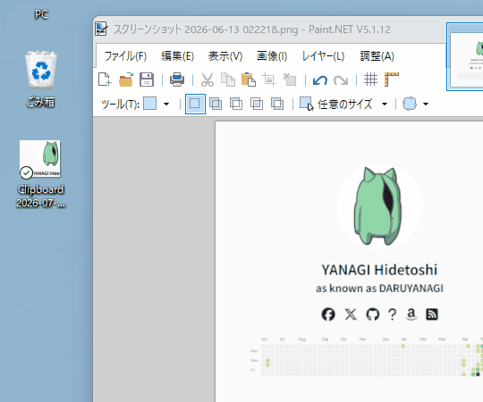
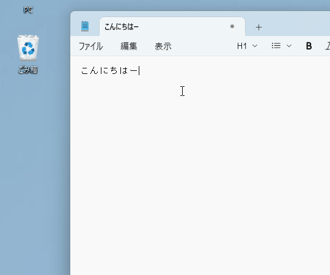
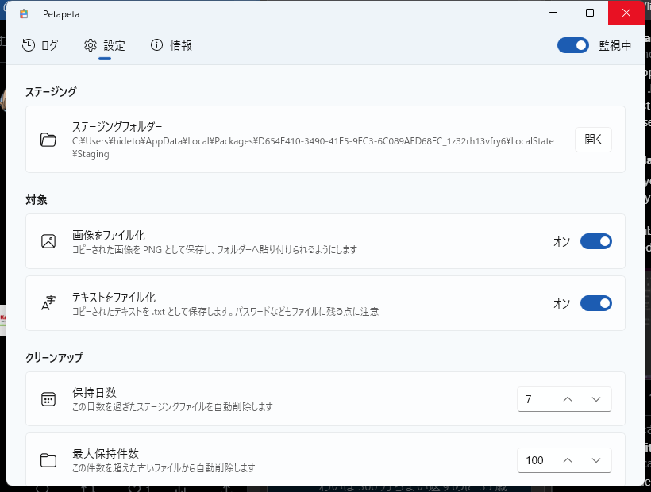

新しいアプリ [Petapeta](https://github.com/daruyanagi/Petapeta) の v1.0.0 をリリースしました。コピーした画像やテキストを、デスクトップやフォルダーへそのままファイルとして貼り付けられるようにする Windows 常駐ツールです。

## どんなアプリ？

むかし BeOS を使っていたとき、クリップボードにコピーした画像やテキストをデスクトップに貼り付けると、自動的にファイルができるという機能がありました。ちょっとしたスクラップを集めておくのにとても便利だったのですが、Windows のエクスプローラーやデスクトップでは画像やテキストを Ctrl+V してもうんともすんとも言いません。

そこで、あの挙動を Windows で再現しようと作ったのが Petapeta です。タスクトレイに常駐してクリップボードを監視し、コピーした内容をファイルとして貼り付けられるようにします。

使い方はシンプルです。

1. Petapeta を起動する（タスクトレイに常駐します）
2. いつもどおり画像やテキストをコピーする
3. デスクトップやフォルダーで Ctrl+V すると、ファイルとして貼り付けられる

画像は PNG ファイル、テキストは .txt ファイルになります。

## 主な機能

- **画像・テキストのファイル化** — クリップボードの画像を PNG、テキストを .txt に。どちらも個別にオン/オフできます
- **通知音** — 貼り付けの準備ができたら通知音でお知らせ（音のカスタマイズ・テスト再生に対応）
- **自動クリーンアップ** — 保持日数や最大件数を決めておけば、古いファイルを自動で片付けます
- **テーマ対応** — ライト / ダーク / システムに追従
- **多言語対応** — 日本語 / English
- **スタートアップ対応** — ~~Windows 起動時の自動開始・最小化起動に対応~~ 動いてないかも。あとで調査

## インストール

[GitHub Releases](https://github.com/daruyanagi/Petapeta/releases/tag/v1.0.0) から ZIP をダウンロードしてお使いください。x64 版と arm64 版を用意しています。

- `Petapeta-v1.0.0-win-x64.zip`
- `Petapeta-v1.0.0-win-arm64.zip`

winget からもそのうちインストールできるようになるはず。

技術的には Windows App SDK / WinUI 3 製で、Windows 10 バージョン 1809 以降 / Windows 11 で動きます。ライセンスは MIT です。

