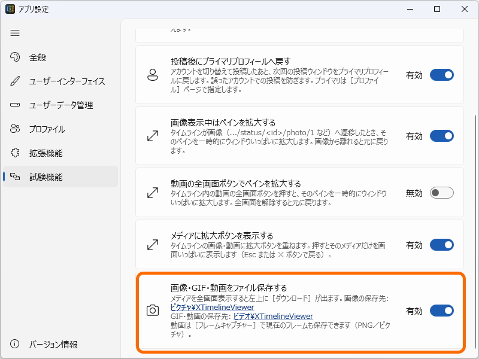
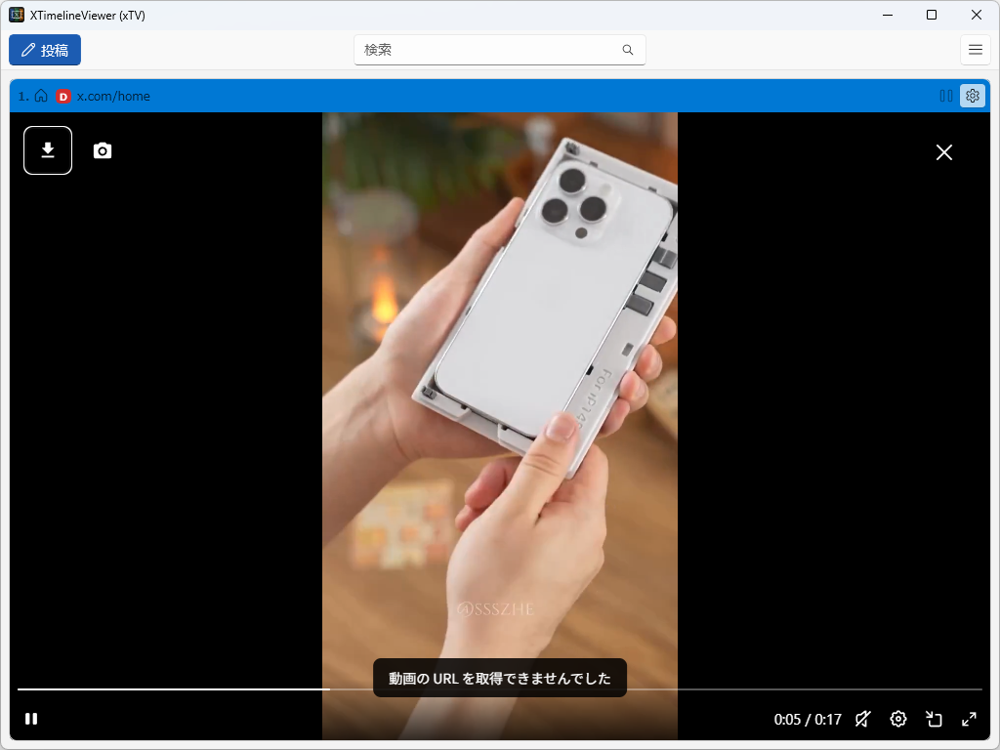
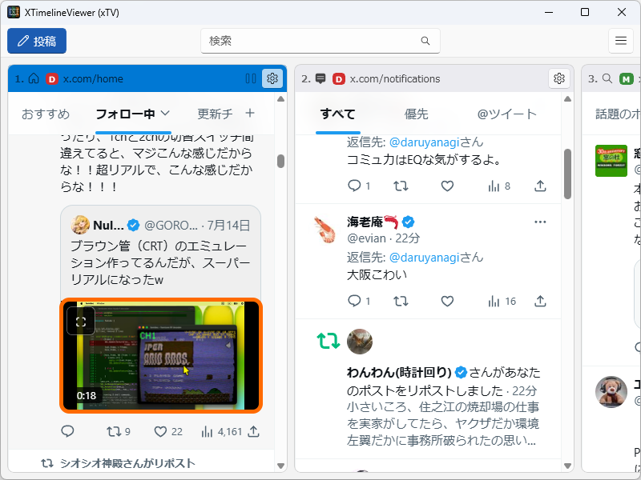
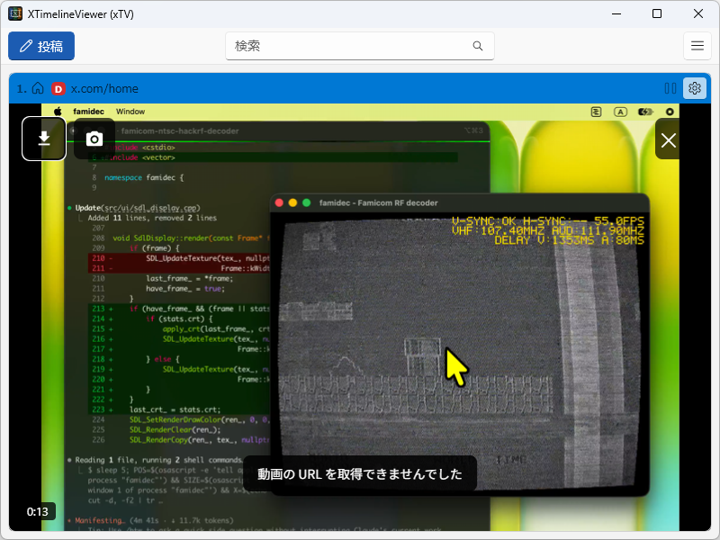
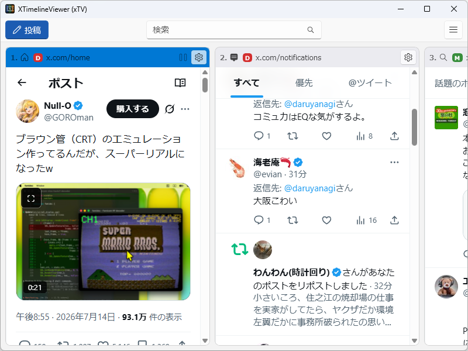
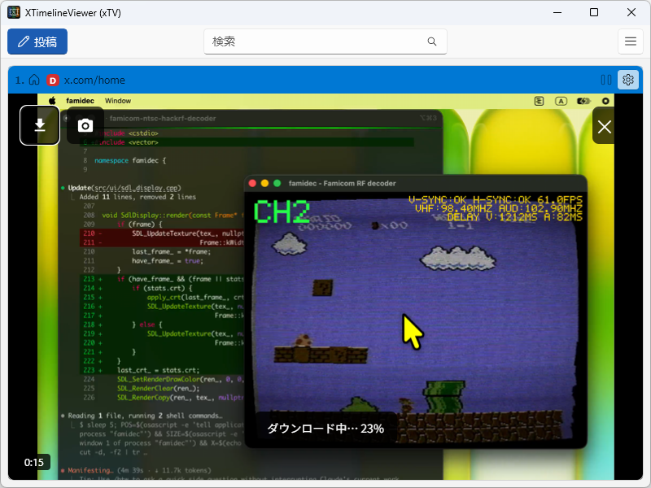

XTimelineViewer（xtv）の試験機能として、動画・画像を保存する機能を導入する予定です（v2.0）。

- 静止画像：画像ファイルとして保存
- GIF：動画ファイル（MP4）として保存
- 動画ファイル：MP4 ファイルとして保存。再生中のフレームを画像ファイルとして保存することも

しかし、一部の動画は保存に失敗します。

プログラム側で対策することも不可能ではないですが、X 側の変更に対して脆弱になり、すぐ壊れてしまうことが予想されるので、ユーザー側での回避をお願いします。

## 失敗例

動画の保存に失敗するケースは、以下のように引用やリポストなどで入れ子表示になっている動画をダウンロードした場合です。

## 回避策

いったん動画を含むポスト（親ポスト）をクリックし、そこから拡大画面へ進んで動画をダウンロードすれば、失敗することはあまりないと思います。

これでも失敗する場合は、ログを添えて [Issues](https://github.com/daruyanagi/XTimelineViewer/issues) まで報告ください