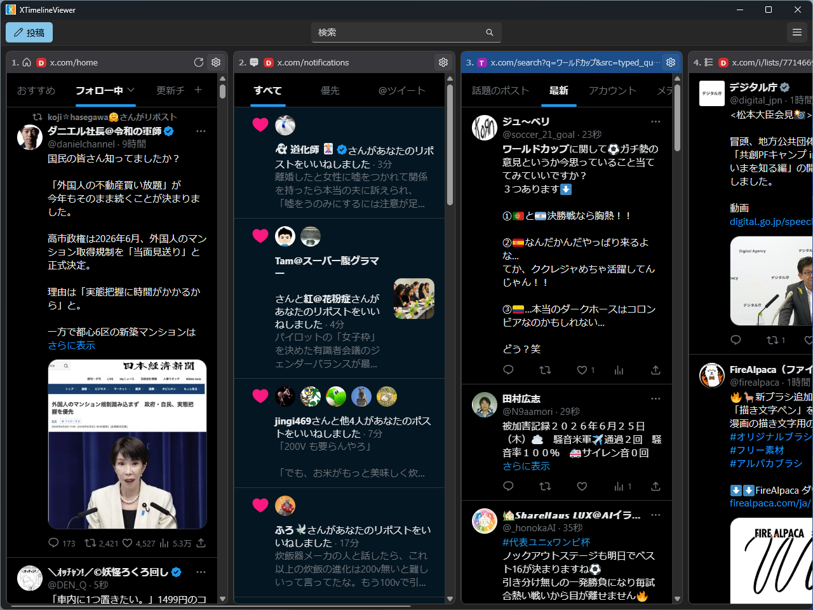

[XTimelineViewer](https://github.com/daruyanagi/XTimelineViewer) の v2.0.0 をリリースしました。ついにメジャーバージョンです。アプリ名とアイコンを一新し、メディアまわりの機能を一気に増やしました。

## アプリ名・アイコンを一新（[#261](https://github.com/daruyanagi/XTimelineViewer/issues/261)）

正式名称は XTimelineViewer のままですが、通称として **「xTV」** を名乗ることにしました。アプリの表示名は「XTimelineViewer (xTV)」、実行ファイルも `xtv.exe` です。


アイコンも TV をモチーフにした v2 デザインに差し替えました。小さいサイズでも見やすいよう最適化した透過素材です。お金だして依頼しましたが、きれいに作っていただいてありがとうございます。

メディアまわりの機能はすべて試験機能です。おいおい説明をブログで紹介するつもり。

## v1.0 からのおもな変更点

2026 年 4 月の v1.0.0 から 4 か月ほどで、ずいぶんいろいろ増えました。機能ごとにまとめておきます。

- **タイムライン表示** — キーボードショートカットでの使い勝手を全面的に改善（`Ctrl+矢印`・`Ctrl+N` などに加え、`Ctrl+数字` でのタイムライン切り替え、フォーカスをまたいだショートカット、個別ツイートページでの操作）。アイコンを追加したり、見た目も改善しました
- **検索** — ツールバーに検索ボックスを追加。さくっと検索タイムラインを追加できます
- **マルチアカウント** — マルチプロファイル対応。オンボーディング（初期セットアップ）エクスペリエンスも追加して、わかりやすくしました
- **投稿画面** — キャッシュして表示を高速化。`Ctrl+P` でのアカウント切り替え、投稿後にプライマリプロフィールへ戻すオプション（誤爆防止）なども追加して使いやすく
- **便利機能** — 直前のポスト・リポストを遡る試験オプション。画像・動画をメディアだけ全画面表示、画像・動画・GIF のダウンロード、動画フレームの画像保存
- **設定・外観** — 設定画面の整備とユーザーデータ管理、ライト / ダーク / システムのテーマ、UI 言語の即時切り替え
- **配布・基盤** — ZIP・MSIX に加えコマンドライン起動用の `xtv.exe`、arm64 対応。配布は GitHub Releases と winget に一本化（Microsoft Store 提出はとりやめ）

---

インストールは [GitHub Releases](https://github.com/daruyanagi/XTimelineViewer/releases/tag/v2.0.0) か winget からどうぞ。

```
winget install daruyanagi.XTimelineViewer
```

winget でインストールすると、次回からはアプリ内からアップデートできます。
