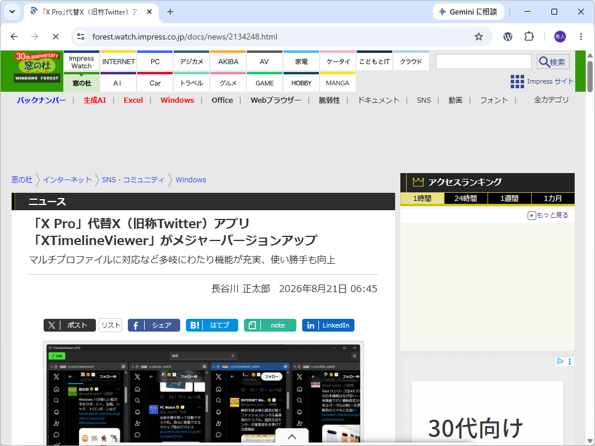

先日リリースした [XTimelineViewer](https://github.com/daruyanagi/XTimelineViewer)（xTV）の v2.0.0 を、窓の杜で紹介していただきました。ありがとうございます！



v2.0.0 の変更点については、こちらの記事にまとめています。

[XTimelineViewer v2.0.0 をリリース](/posts/2026/08/05/)

v3.0 では、v2.0 を作る過程で宙ぶらりんになった拡張機能とか自動更新機能とかを作り込んでいきたいかなぁ。winget への登録が Microsoft Defender の偽陽性でよく止まるのも悩みの種
