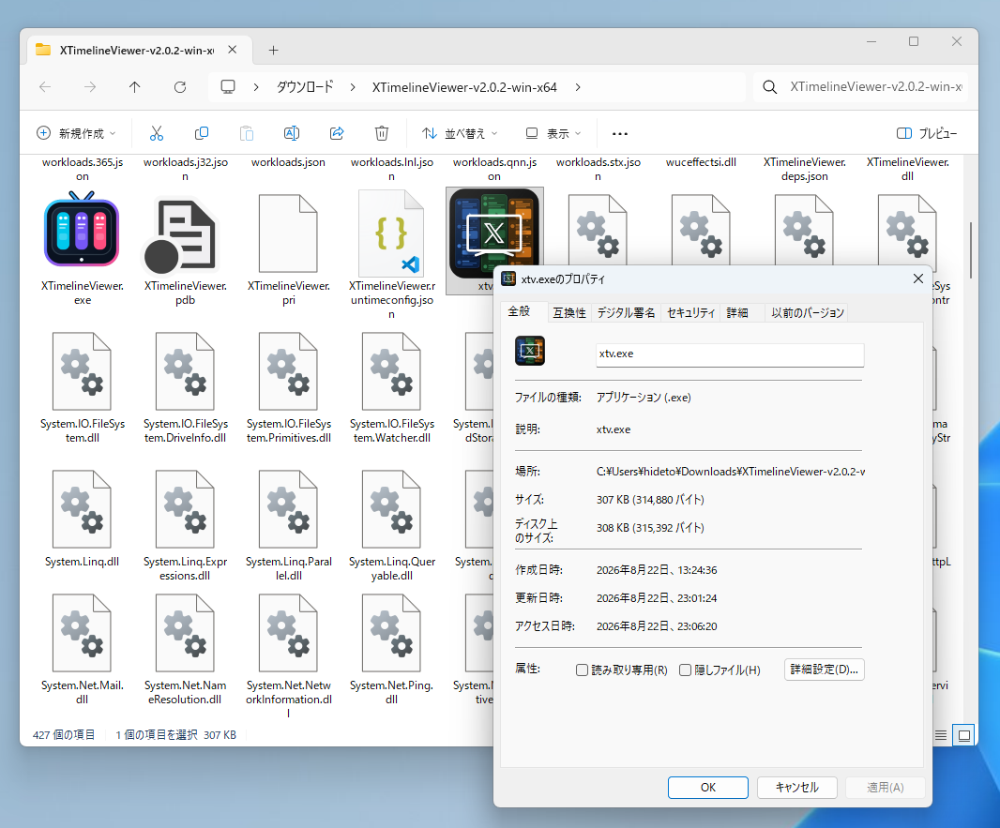
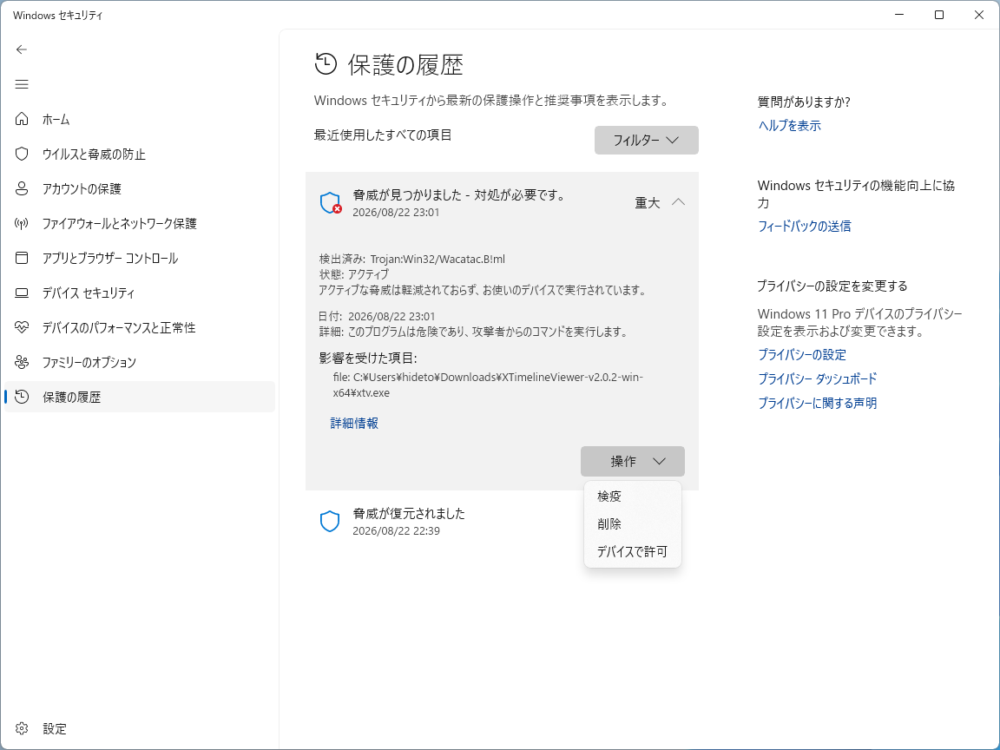

[XTimelineViewer](https://github.com/daruyanagi/XTimelineViewer)（xTV）に同梱している `xtv.exe` が、Microsoft Defender に **`Trojan:Win32/Wacatac.B!ml`** としてマルウェア判定され、勝手に検疫（削除）されてしまう問題が報告されています。ごめんなさい。

v2.0.1・v2.0.2 の ZIP、そして winget で入れた場合の `xtv.exe` が対象です。もちろん **誤検知（偽陽性）** で、実際に悪さをするコードは入っていません。

## xtv.exe ってなに？

`xtv.exe` は、コマンドラインから `xtv` の一言でアプリを起動できるようにするための、小さなランチャーです。本体（`XTimelineViewer.exe`）は .NET の self-contained 構成で、ターミナルから直接叩くと DLL の解決に失敗することがあったため、依存 DLL ゼロの C++ で書いた別プロセスを噛ませています。やっていることは「同じフォルダーの本体を起動して、引数をそのまま渡す」だけです。

~~(将来的には ZIP 版の自動更新機能も担う予定)~~ やめることになりそう

## なぜ誤検知される？

検出名の末尾の `!ml` が示すとおり、これは機械学習ベースのヒューリスティック判定です。ファイルの中身ではなく、**見た目の特徴**で「怪しい」と拾われています。

`xtv.exe` は、たまたまマルウェア（ドロッパー）と見分けのつきにくい特徴が揃ってしまっていました。

- 署名がない
- **バージョン情報リソースが空**（製品名・会社名・説明・バージョンがすべて未設定）
- CRT を静的リンクした小さなネイティブ exe
- 起動すると別プロセスを起こすだけ

## 対処

根本的にはコード署名を入れるのが一番ですが、コストがかかるので難しいです。

一応 [Azure Artifact Signing](https://github.com/daruyanagi/XTimelineViewer/issues/336)（月 $9.99）を検討していますが、いまのところ個人開発者だと対応国が米国・カナダのみで、日本はまだ対象外のようです。従来型の EV 証明書は年に数万円かかるうえトークンも必要で、個人の道楽アプリにはちょっと重い。

さしあたっては、`xtv.exe` に**バージョン情報リソースを埋め込む**ことで、ヒューリスティックに引っかかりにくくすることを試します（[#383](https://github.com/daruyanagi/XTimelineViewer/issues/383)）。発行元や製品名がきちんと入っているだけでも、だいぶ印象が変わるはずです。

## もし検疫されてしまったら

Defender が `xtv.exe` を消してしまっても、**本体（`XTimelineViewer.exe`）は無事**なことがほとんどです。アプリ自体はそちらから起動できます。（今のところ） `xtv.exe` はあくまでコマンドライン起動を便利にするためのおまけなので、なくても機能に影響はありません。

どうしても `xtv` コマンドを使いたい場合や、検疫を解除したい場合は、Windows セキュリティの「保護の履歴」から該当項目を「許可」してください。ただし、誤検知だと確信できるとき以外は、むやみに許可しないようご注意を。

1. [windowsdefender://history](windowsdefender://history) にアクセス
2. 「脅威が見つかりました。対処が必要です」という項目を開く（UAC の許可が必要です）
3. ［デバイスで許可］を選択

ご不便をおかけします。署名まわりは、対応国の拡大を待ちつつ引き続き検討します。
