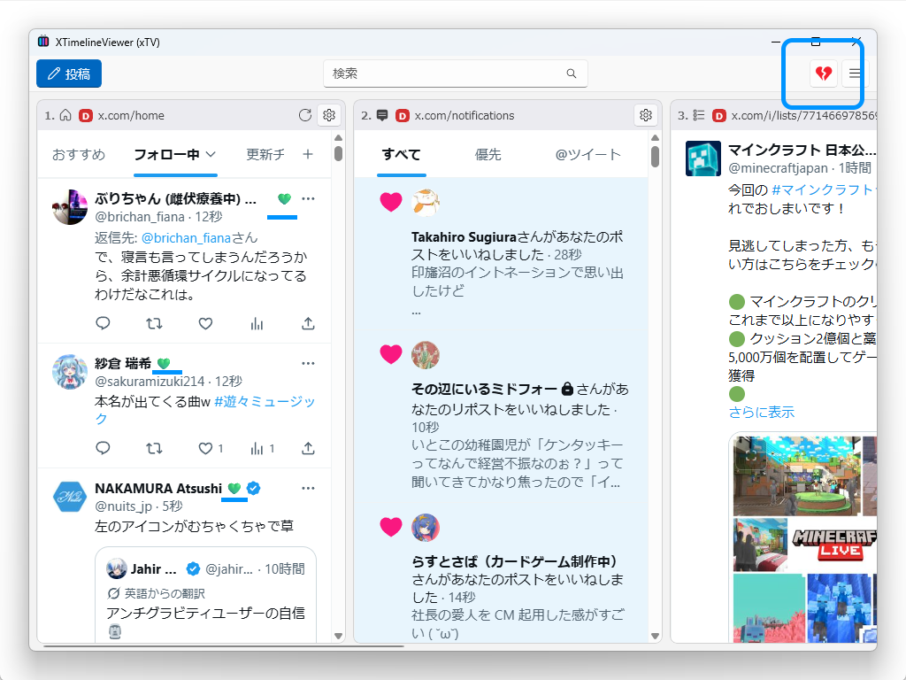
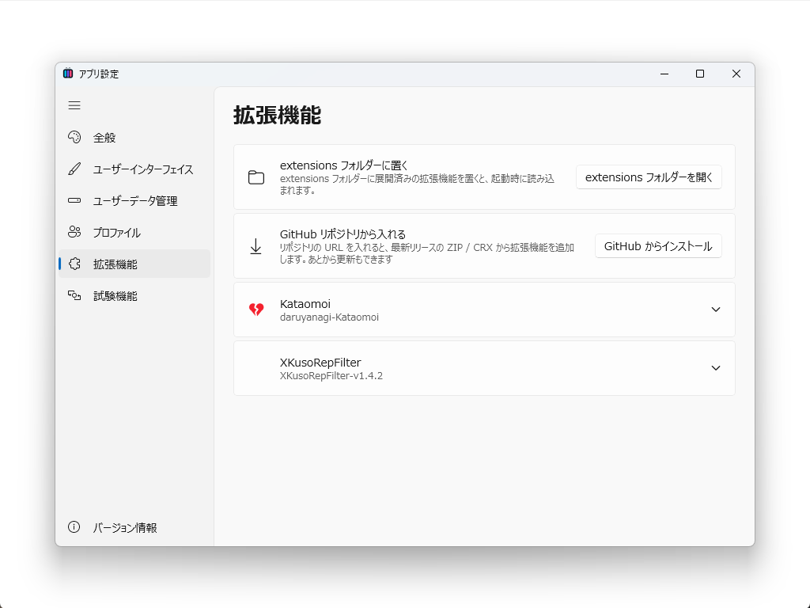
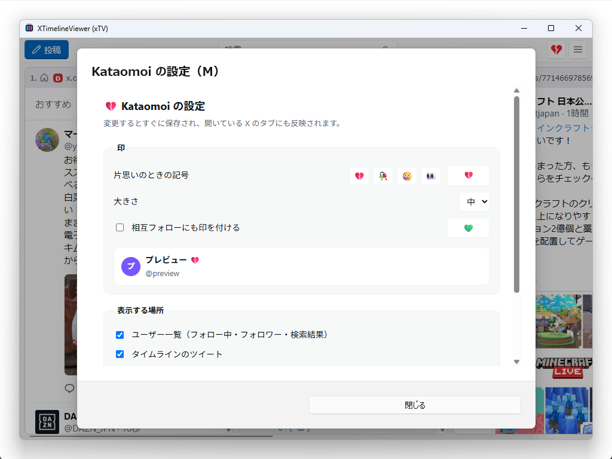
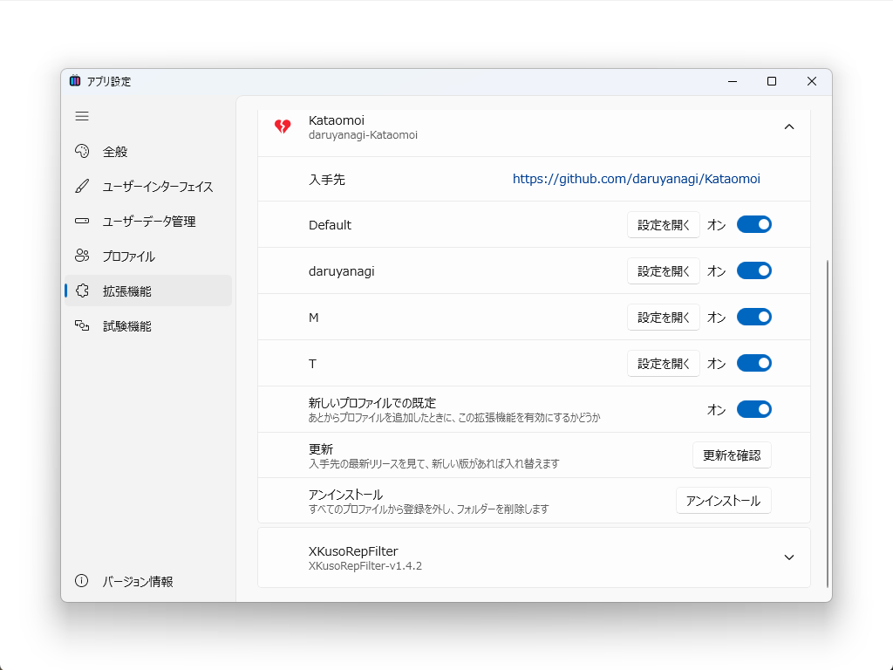

[XTimelineViewer](https://github.com/daruyanagi/XTimelineViewer)（xTV）でぶっ壊れていたブラウザー拡張機能対応を再構築しました。v2.0 でマルチアカウント対応したときに存在を忘れていました……まぁ、日頃拡張機能ってあんまり使わないんでね。

## GitHub からインストール



拡張機能ページに「GitHub からインストール」を用意しました。リポジトリの URL を入れると、最新リリースの ZIP を落として展開し、そのまま読み込みます。

Chrome ウェブストアからの直接インストールも考えたのですが、ちょっとテクニカルな実装にしなきゃいけないっぽいので（`.crx` の配信エンドポイントは非公開で、Google の利用規約もプログラムからの取得を制限しています）止めました。まぁ、拡張機能はだいたい GitHub でソースコードが公開されているから大丈夫でしょう。

もちろん、これまでどおり `extensions` フォルダーへ**直置きする方法も残してあります**……が、あんまりメンテナンスしていないので動かないかも。何か問題があれば知らせてください

## プロファイルごとに ON/OFF・アンインストール

拡張機能はプロファイルごとに ON/OFF、設定できます。（[#398](https://github.com/daruyanagi/XTimelineViewer/issues/398)）



設定はツールバーのボタンからどうぞ。どのタイムラインをアクティブにしてあるかによって、どのプロファイルに適用される設定なのかが変わるので、ヘッダーで現在のプロファイルをよく確認してから変更してください。



ON/OFF は［設定］ダイアログで。更新やアンインストールもここから行えます。ときどきチェックするといいかもしれませんね。（[#406](https://github.com/daruyanagi/XTimelineViewer/issues/406), [#404](https://github.com/daruyanagi/XTimelineViewer/issues/404)）

## v2.2.0 での仕上げ

最新版では v2.2.0 で、細かい取りこぼしも直しています。

- **アンインストール後に同じ拡張機能を入れ直すと一覧にもツールバーにも出ない**（[#419](https://github.com/daruyanagi/XTimelineViewer/issues/419)）— 後始末の取りこぼしを修正
- **拡張機能の設定ページが開けない**（[#420](https://github.com/daruyanagi/XTimelineViewer/issues/420)）— 決め打ちだった対象プロファイルを直した

winget に申請したパッケージが Microsoft Defender に弾かれ、なかなか登録されず、告知が遅れました（ついでにブログ書くのめんどくなってました）。ごめんなさい

---

これで「お気に入りの拡張機能を入れて、プロファイルごとに使い分けて、アプリを更新しても消えない」という、当たり前のことが当たり前にできるようになりました。

インストールは [GitHub Releases](https://github.com/daruyanagi/XTimelineViewer/releases/latest) か winget からどうぞ。

```
winget install daruyanagi.XTimelineViewer
```
