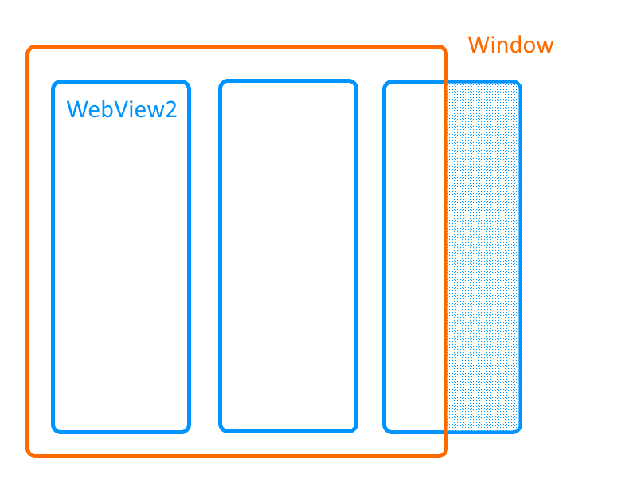

xTV でちょっと面白いフィードバックをいただきました。

[ウィンドウ外に飛び出たカラムにも判定が残っておりデスクトップの操作が出来なくなる · Issue #418 · daruyanagi/XTimelineViewer](https://github.com/daruyanagi/XTimelineViewer/issues/418)

自分も最初はよくわからなかったのですが……

ウィンドウへこのように WebView2 を並べたとき、ウィンドウにはみ出ちゃったりしますよね。もちろん、ウィンドウからはみ出た部分の WebView2 は非表示にはなるんですが、なんか見えないウィンドウが残ったような感じになり、当該箇所では **デスクトップ操作ができない（マウス入力がデスクトップにまでいきわたらない）** っぽいのです。たとえば、このエリアでは右クリックメニューが出せなかったり、デスクトップにおいたファイルをクリックで選択できなかったりします。

xTV では WebView2 をたくさん横に並べるわけで、そうするとデスクトップの操作不能領域が増えていきます。

この問題は [v2.2.0](https://github.com/daruyanagi/XTimelineViewer/releases/tag/v2.2.0) で緩和済み。ウィンドウからはみ出たタイムラインは一時的にバックグラウンドで非表示にすることで、デスクトップ操作を妨げないようになっています。

ですが、ウィンドウにちょっとでも表示されているタイムラインはそうはいきません。なので、そいつがウィンドウからはみ出ているエリアだけ、ちょこっと操作不能エリアが残ってしまいます。

これは仕様ということでお許しください。

Windows App SDK 1.8 から 2.x へ更新できれば解決する可能性もありますが、依存関係があってまだ調査中です。

最後に。

この不具合を報告してくださった [advanced bear](https://github.com/advancedbear) さんに感謝申し上げます。自分の使い方ではずっと気付かなかったと思います！