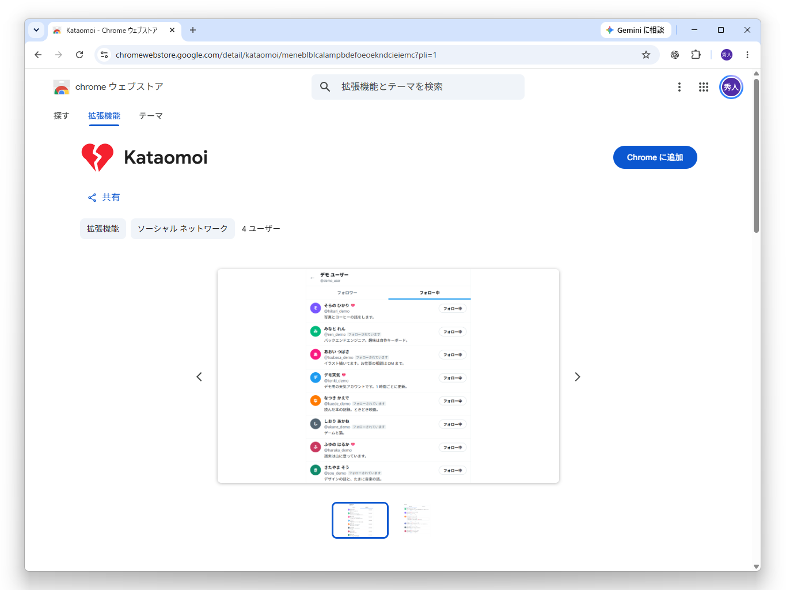

Google Chrome 拡張機能「[Kataomoi](https://chromewebstore.google.com/detail/kataomoi/meneblblcalampbdefoeoekndcieiemc)」をリリースしました。簡単に言うと、「X でフォローしているのにフォローバックされていないユーザー」を可視化するものです。ときどき悲しい気持ちになりますが、それでもいいという方は使ってみてください。

この拡張機能は [xTV](https://github.com/daruyanagi/XTimelineViewer) で「GitHub から拡張機能を追加・更新・削除する」機能をテストするために作りました。あんまりアップデートする気はないですが、リクエストがあれば受け付けます。



